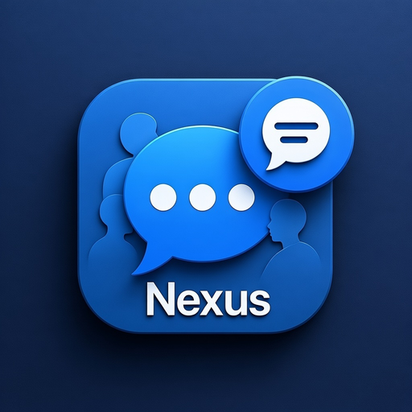
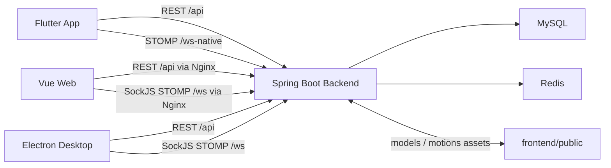

  
  <h1>Nexus Chat</h1>
  
<strong>使用Spring Boot、Electron/Vue3和Flutter构建的多客户端实时聊天系统。</strong>

## 1. 项目整体定位

这不是一个单一前端项目，而是一个完整的即时通讯产品工作区，分为三层:

| 目录 | 角色 | 主要技术 |
|---|---|---|
| `nexus-chat-backend` | 核心服务端，提供鉴权、消息、群组、联系人、社区、AI 陪伴、文件、同步、版本更新等能力 | Spring Boot 3.2, Java 17, MySQL, Redis, STOMP WebSocket |
| `nexus-chat-frontend` | Web + Electron 桌面端主界面，功能最完整 | Vue 3, Pinia, Vite, Element Plus, Electron, Dexie, Three.js |
| `nexus-chat-app` | Flutter 移动端客户端，偏移动场景体验 | Flutter, Dio, STOMP, Hive, SecureStorage, 本地通知 |

可以把它理解成:

- `backend` 是唯一的业务中台和数据源。
- `frontend` 是桌面/Web 主客户端，承担最丰富的交互能力。
- `app` 是面向手机的独立客户端，复用后端接口，但 UI 和实现方式完全独立。

## 2. 根目录协作关系

根目录不仅是三个子项目的容器，还负责把它们串起来。

### 2.1 部署入口

- `docker-compose.yml`
  - 启动 `mysql + redis + backend + frontend + cloudflared`
  - 适合 Web/Electron 体系的公网发布
- `docker-compose-app.yml`
  - 启动 `mysql + redis + backend`
  - 让手机 App 直接通过公网 IP 访问后端
- `nginx/nginx.conf`
  - 负责 Vue 静态资源
  - 反代 `/api`
  - 反代 `/ws` 和 `/ws-native`
  - 暴露 `/uploads`
- `.env.example`
  - 定义 MySQL、JWT、CORS、邮件、Companion 密钥等运行参数

### 2.2 整体通信关系

关键点:

- Web/Electron 走 `/ws`，依赖 SockJS 兼容层。
- Flutter 走 `/ws-native`，直接使用原生 WebSocket STOMP。
- 后端除数据库外，还把 Redis 用在在线状态、未读数、离线消息、消息序号、跨实例转发。
- Companion 3D 资产在本地开发模式下和 `nexus-chat-frontend/public/models`、`public/motions` 直接耦合。

## 3. `nexus-chat-backend` 详解

### 3.1 项目定位

`nexus-chat-backend` 是整个产品的业务核心。它不仅负责用户、聊天、群组和文件，还扩展了:

- 社区帖子
- 关注/粉丝
- 增量同步
- App 更新检查
- AI 陪伴角色、记忆、状态、模型绑定
- 3D 模型和动作资源管理

### 3.2 技术栈与规模

- Spring Boot 3.2.0
- Java 17
- Spring Web / Security / WebSocket / Data JPA / Data Redis / Mail
- MySQL
- Redis
- JWT
- Maven

当前源码规模大致为:

- `148` 个 Java 源文件
- `13` 个 Controller
- `20` 个 Service
- `30` 个 Entity/Model
- `30` 个 Repository

### 3.3 目录结构

核心结构如下:

- `src/main/java/com/nexus/chat/NexusChatApplication.java`
  - 应用入口，开启异步和定时任务
- `config/`
  - 安全、CORS、WebSocket、Redis、国际化、限流、消息校验
- `controller/`
  - REST API 入口层
- `service/`
  - 业务逻辑层
- `repository/`
  - JPA 数据访问层
- `model/`
  - 数据实体
- `dto/`
  - 前后端传输对象
- `security/`
  - JWT 鉴权过滤器和 Token Provider
- `websocket/`
  - 实时消息控制器
- `resources/`
  - `application*.properties`、建表 SQL、日志、国际化、迁移脚本

### 3.4 REST API 能力边界

从 Controller 划分看，这个后端已经不是“纯聊天 API”，而是完整社交产品后端。

#### 认证与用户

- `AuthController`
  - 发送验证码
  - 校验验证码
  - 注册
  - 登录
  - 登出
- `UserController`
  - 用户查询、搜索、推荐
  - 资料读取与更新
  - 头像上传/删除
  - 隐私设置
  - 背景图
  - 社交链接
  - 活动流
  - 资料更新后通过 WebSocket 广播 `USER_PROFILE_UPDATED`

#### 聊天与消息

- `ChatController`
  - 创建私聊
  - 创建群聊
  - 获取用户聊天列表
  - 获取聊天详情
- `MessageController`
  - REST 发送消息
  - 分页获取消息
  - 单条/整聊已读
  - REST 发消息后仍会触发统一 WebSocket 通知

#### 联系人和群组

- `ContactController`
  - 添加联系人或发送好友申请
  - 删除联系人
  - 联系人列表
  - 是否为好友
  - 共同好友
  - 好友申请收件箱/发件箱/数量
  - 接受/拒绝申请
- `GroupController`
  - 群信息、群成员、加人、踢人、退群、解散、管理员、转让群主

#### 社区能力

- `PostController`
  - 发帖、删帖
  - 推荐/热门/最新
  - 用户帖子
  - 搜索
  - 点赞/点踩
  - 收藏
  - 评论、回复、评论点赞
- `FollowController`
  - 关注、取消关注
  - 关注状态
  - 关注列表/粉丝列表

#### 文件与版本

- `FileUploadController`
  - 单文件上传
  - 分片上传
  - MD5 秒传
  - 文件信息
  - 下载
  - 在线预览
- `AppVersionController`
  - `GET /api/app/check-update`
  - 给移动端提供版本号、下载地址、更新日志、强更标记

#### 增量同步

- `SyncController`
  - `GET /api/sync/delta`
  - 按 `since` 时间戳增量同步消息、聊天和联系人
  - 这和桌面端 IndexedDB 离线缓存设计是配套的

#### Companion / AI 陪伴

- `CompanionController`
  - 初始化默认角色
  - 获取/更新角色
  - 获取对话
  - 发送消息
  - 管理记忆
  - 获取成长值和状态
  - 保存模型凭据
  - 绑定模型与 endpoint
- `CompanionAssetController`
  - 上传/重命名 3D 模型
  - 上传/重命名/删除动作文件
  - 读取模型库和动作库

### 3.5 实时通信架构

这是后端最关键的一层。

#### WebSocket 入口

- `/ws`
  - SockJS STOMP 端点，给 Web/Electron 用
- `/ws-native`
  - 原生 WebSocket 端点，给 Flutter 用

#### STOMP 约定

- Broker 前缀: `/topic`, `/queue`
- 应用前缀: `/app`
- 用户前缀: `/user`

#### 统一用户频道

当前实现的核心思想是:

- 所有实时事件尽量统一投递到 `/topic/user.{userId}.messages`
- 不再以“每个 chat 一个 topic”作为主通信模型

这个频道承载:

- 新消息
- ACK
- 输入中状态
- 已读回执
- 群成员变化
- 通话信令
- 错误事件

#### Redis 在实时层的作用

`RedisCacheService` 和 `RedisMessageRelay` 让 WebSocket 具备了更接近生产系统的能力:

- 在线状态 Presence
  - 90 秒 TTL
  - 客户端每 30 秒发心跳
  - 支持多设备会话
- 离线消息队列
  - 目标用户离线时先写 Redis List
  - 上线后回放
- 输入中状态
  - 5 秒 TTL
- 未读数
- 聊天缓存
- 消息序号
  - 通过 Redis INCR 生成单调递增 `sequenceNumber`
- 跨实例转发
  - 通过 Redis Pub/Sub 广播到其它实例，再由本地实例判断目标用户是否在线

#### 其他实时细节

- `WebSocketAuthChannelInterceptor`
  - WebSocket 优先走 JWT
  - 仍兼容旧式 `userId` 头
- `MessageValidationInterceptor`
  - 文本校验、XSS 清洗、URL 校验
- `WebSocketRateLimiter`
  - 基于 Redis 的限流
- `WebSocketController`
  - 覆盖消息、状态、typing、read receipt、group event、contact event、call signaling

### 3.6 数据模型

从 `schema.sql` 和 `model/` 可以看出，数据库已经覆盖了多种业务域。

核心表包括:

- `users`
- `user_privacy_settings`
- `contacts`
- `contact_requests`
- `chats`
- `chat_members`
- `messages`
- `message_read_status`
- `file_uploads`

社交和扩展表包括:

- `posts`
- `post_comments`
- `post_votes`
- `post_bookmarks`
- `comment_likes`
- `user_follows`
- `user_social_links`
- `user_security_settings`
- `user_sessions`
- `login_history`
- `user_activities`

Companion 相关表包括:

- `companion_roles`
- `companion_conversations`
- `companion_messages`
- `companion_memories`
- `companion_growth`
- `companion_status`
- `model_credentials`
- `companion_model_bindings`

### 3.7 文件与定时任务

后端不只是保存元数据，文件生命周期也有管理逻辑。

- 上传目录: `uploads/`
- 支持单文件上传和分片合并
- `FileCleanupService`
  - 每天凌晨 3 点清理过期文件
  - 清理未完成上传
  - 清理孤立分片目录

### 3.8 Companion 模块的设计特点

这一块是本项目区别于普通 IM 项目的重点。

- 初始会为用户创建 3 个默认角色
  - 温柔倾听者
  - 理性伙伴
  - 活力陪玩
- 每个角色有:
  - 名称
  - traits
  - tone
  - baseline mood
  - growth
  - status
  - memory
  - conversation history
- 模型调用方式不是写死 OpenAI SDK，而是“OpenAI-compatible endpoint”
  - 客户端保存 provider / model / endpoint
  - 服务端保存并加密 API Key
  - `CompanionModelService` 按 `/v1/chat/completions` 规范请求
- 如果远程模型失败，会回退到 `CompanionFallbackService`

这意味着 Companion 模块本质上是一个“可配置的陪伴型 LLM 中间层”，而不是单纯的前端假 UI。

### 3.9 配置与部署

#### 开发/生产/容器配置

- `application.properties`
  - 本地开发配置
- `application-prod.properties`
  - 生产配置
- `application-docker.properties`
  - 容器环境配置

#### Docker 化

- `Dockerfile` 使用多阶段构建
  - Maven 构建 JAR
  - Temurin 17 JRE 运行
- 运行容器时会创建:
  - `/app/uploads`
  - `/app/apk`

#### 与前端资源目录的耦合

Companion 资产路径有两种模式:

- 本地开发: 指向 `../nexus-chat-frontend/public`
- Docker: 指向 `/data/companion-assets`

这说明 Companion 资源管理是“后端可写、前端可直接静态读取”的设计。

### 3.10 当前观察

当前后端实现已经很丰富，但有几处工程信号值得单独记住:

- `application.properties` 和 `application-prod.properties` 中存在硬编码敏感配置，不适合继续保留在仓库里。
- 多个 profile 都在使用 `spring.jpa.hibernate.ddl-auto=update`，上线环境存在 schema 漂移风险。
- 自动化测试基本缺失，`src/test` 下没有有效测试代码。
- WebSocket、Redis、同步、Companion 都已经进入“可运行复杂系统”阶段，但回归保障不足。

## 4. `nexus-chat-frontend` 详解

### 4.1 项目定位

`nexus-chat-frontend` 是当前功能最完整、体验最丰富的客户端实现。

它同时服务两种运行形态:

- 浏览器 Web 版
- Electron 桌面版

它并不是简单共享 UI，而是显式处理了:

- Web/Electron 路由模式差异
- 原生窗口控制
- 托盘
- 通知
- 桌面端媒体权限
- GitHub Release 更新检查

### 4.2 技术栈与规模

- Vue 3
- Pinia
- Vue Router 4
- Element Plus
- Vite 5
- Electron 28
- Axios
- STOMP.js + SockJS
- Dexie / IndexedDB
- Three.js + `@pixiv/three-vrm`

源码规模大致为:

- `6` 个视图页面
- `25` 个组件
- `6` 个 Pinia Store
- `6` 个 Service
- `58` 个 `src + electron` 文件

### 4.3 启动入口和路由

关键入口:

- `src/main.js`
  - 挂载 Pinia、Router、Element Plus、i18n
- `src/App.vue`
  - 基础容器，启动时从 `localStorage` 恢复用户
- `src/router/index.js`
  - Electron 用 `HashHistory`
  - Web 用 `History`
  - 路由守卫基于本地 `token`

页面路由包括:

- `/login`
- `/setup`
- `/main`
- `/settings`
- `/profile`
- `/user/:id`

其中 `/setup` 看起来更像早期或辅助流程页面，因为当前真实登录流程主要仍由 `/login` 驱动。

### 4.4 主界面布局

`Main.vue` 是桌面/网页主工作台，结构非常清晰:

- `LeftPanel`
  - 聊天/联系人/群组三标签
  - 搜索
  - 设置入口
  - 新建群聊、添加联系人
  - Electron 下的窗口控制按钮
- `MiddlePanel`
  - 当前会话头部
  - 消息列表
  - 输入区
  - 音视频呼叫入口
- `RightPanel`
  - 私聊资料 / 群资料 / 群成员管理 / 搜索历史 / 置顶静音等
- `CompanionAvatar3D`
  - 右下角 3D 陪伴挂件
- `CompanionPanel`
  - 可拖拽、可缩放的陪伴操作窗
- 通话组件
  - `IncomingCallModal`
  - `OutgoingCallModal`
  - `CallView`
  - `CallEndModal`

整体上，这个前端的核心体验是“即时通讯主界面 + 陪伴组件 + 桌面壳能力”的组合。

### 4.5 状态管理设计

Pinia Store 划分比较成熟:

- `user.js`
  - 登录、登出、资料、背景、隐私、社交链接
- `chat.js`
  - 会话列表、当前会话、置顶、静音、未读数
- `message.js`
  - 按 chatId 管理消息
  - 临时消息替换
  - ACK 后合并
  - typing 状态
- `contact.js`
  - 联系人、好友申请、推荐用户、共同好友
- `call.js`
  - 通话状态机
  - 来电/去电/响铃/连接中/已接通/结束
  - 对接 WebRTC 与 WebSocket 信令
- `companion.js`
  - 角色、消息、记忆、成长值、状态、模型凭据、模型绑定

这一层说明桌面端已经不再是“简单 API 调用器”，而是完整的前端状态机。

### 4.6 Service 层设计

#### `api.js`

统一封装了后端 REST 接口:

- auth
- user
- chat
- message
- contact
- group
- sync
- companion
- file

它还提供了 `resolveFileUrl()`，把 `/uploads/...` 之类的相对地址转成后端完整地址。

#### `websocket.js`

这是前端实时能力的中心。

关键特点:

- 使用 SockJS + STOMP
- 连接后订阅统一频道 `/topic/user.{userId}.messages`
- 同步处理:
  - 聊天消息
  - ACK
  - 投递失败
  - typing
  - 已读
  - 群事件
  - 联系人事件
  - 通话信令
- 内置重连、心跳、页面可见性处理
- 维护 pending ACK 映射，支持“乐观消息 -> 服务端确认”流程

#### `db.js` + `offlineStore.js`

前端实现了本地离线缓存:

- IndexedDB 名称: `NexusChatDB`
- 表:
  - `messages`
  - `chats`
  - `contacts`
  - `syncMeta`
  - `pendingMessages`

这意味着它不是“断网即废”的薄前端，而是有明显的离线优先设计。

#### `syncService.js`

和后端 `SyncController` 配套，实现:

- 根据最后同步时间拉取增量
- 合并消息、聊天、联系人
- 刷新本地 Dexie
- 重连后刷出待发送消息

这套逻辑和微信式“先开 UI，再连 WS，再补 delta，再冲离线消息”的思路一致。

#### `webrtc.js`

负责:

- 音视频采集
- RTCPeerConnection
- SDP offer/answer
- ICE candidate
- 连接状态管理

和 `call.js` + `websocket.js` 配合完成桌面端通话能力。

### 4.7 Companion / 3D 能力

这是前端差异化最强的模块。

#### 入口

- `components/companion/CompanionAvatar3D.vue`
- `components/companion/CompanionPanel.vue`

#### 功能特点

- 支持加载:
  - VRM
  - GLB/GLTF
  - FBX
- 支持 `motions.json` 配置动作库
- 支持本地模型导入、动作导入、重命名、切换
- 支持 Mixamo 动作重定向到 VRM humanoid
- Companion Panel 中还集成:
  - 对话
  - 记忆管理
  - 成长值查看
  - 3D 模型设置
  - OpenAI-compatible 模型凭据与绑定

`public/models` 与 `public/motions` 存放默认资源，这些目录和后端 Companion 资源管理接口是联动的。

### 4.8 Electron 层实现

`electron/main.js` 和 `preload.js` 说明桌面版不是单纯 WebView 包装，而是显式补了原生能力:

- 窗口创建
  - macOS 使用 `hiddenInset`
  - Windows/Linux 使用无边框窗口
- 托盘
- 原生通知
- 始终置顶
- 外链打开
- 媒体权限申请
- GitHub Release 更新检查
- preload 桥接 `electronAPI`

在 Vue 端，`LeftPanel`、`Settings.vue`、`TitleBar.vue`、通话组件等都直接使用了这个桥。

### 4.9 环境配置与部署

环境文件:

- `.env.development`
  - 本地 `http://localhost:8080/api`
- `.env.production`
  - `/api` + 指定 WebSocket 地址
- `.env.electron`
  - Electron 标记和生产服务地址

`vite.config.js` 会根据是否 Electron 切换 `base` 和路由模式。

`Dockerfile` 则采用:

- Node 20 Alpine 构建前端
- Nginx Alpine 运行静态资源

根目录 `nginx/nginx.conf` 最终负责把 Web 资源和后端 API/WS 串起来。

### 4.10 当前观察

- 桌面/Web 端是当前三者中工程完成度最高的一端。
- Companion、通话、离线缓存、增量同步都已具备明确实现，不是占位目录。
- `Setup.vue` 仍带有较强的本地 mock 色彩，和当前真实鉴权主线不完全一致，像遗留/过渡页面。
- 工作区里已包含 `dist`、`dist-electron`、`node_modules`，说明当前仓库偏“开发现场快照”而非严格瘦身版源码。
- 项目级测试基本缺失。

## 5. `nexus-chat-app` 详解

### 5.1 项目定位

`nexus-chat-app` 是 Flutter 移动端客户端，承担:

- 登录/快速登录
- 消息与会话列表
- 联系人和好友申请
- 群聊
- 社区帖子
- 个人中心与设置
- 本地通知和应用内横幅通知

它不是前端的 WebView，也不是 Electron 共用 UI，而是一套完全独立的移动端代码。

### 5.2 技术栈与规模

- Flutter
- Dio
- STOMP Dart Client
- Hive
- Flutter Secure Storage
- Flutter Local Notifications
- Cached Network Image
- Image Picker / Cropper

源码规模大致为:

- `55` 个 `lib` 文件
- `25` 个页面文件
- `4` 个 Repository
- `7` 个远程 API Service
- `6` 组模型定义目录

需要特别指出:

- `pubspec.yaml` 声明了 `flutter_riverpod`、`riverpod_annotation`、`go_router`
- 但当前 `lib/` 内基本没有真正使用这些依赖
- 实际代码仍然以 `StatefulWidget + Repository + Navigator.push` 为主

也就是说，移动端的架构目标和现状之间还有一段距离。

### 5.3 代码分层

移动端采用比较标准的三层结构:

- `core/`
  - 配置、网络、通知、状态管理、安全存储
- `data/`
  - `datasources/remote`
  - `models`
  - `repositories`
- `presentation/`
  - 页面与通用组件

这是目前三个项目里最清晰的“分层式”目录组织。

### 5.4 应用启动流程

`main.dart` 做了几件关键事:

- 初始化 Hive
- 初始化 `UserStateManager`
- 初始化 `MessageService`
- 锁定竖屏
- 设置系统 UI 样式

`app.dart` 里:

- 设置 `MaterialApp`
- 注册全局 `navigatorKey`
- 配置亮暗主题
- 启动到 `SplashPage`

### 5.5 登录与导航流程

当前主导航是手写的，不是 `go_router`。

实际流程是:

- `SplashPage`
  - 检查是否已登录
  - 检查是否有“记忆账号”
- 如果会话有效
  - 进入 `MainNavigationPage`
- 如果无有效会话但有记忆账号
  - 进入 `QuickLoginPage`
- 否则
  - 进入 `LoginPage`

这套流程和 `SecureStorageService` 的“软登出 / 账号记忆 / 30 天会话有效期”设计是配套的。

### 5.6 主页面结构

`MainNavigationPage` 是移动端主容器，底部有四个 Tab:

- 消息
- 联系人
- 社区
- 我

对应页面:

- `MessagesPage`
- `ContactsPage`
- `CommunityPage`
- `ProfilePage`

另外还包含:

- `ChatPage`
- 群创建与群设置页面
- 发帖、帖子详情、收藏页
- 资料编辑、设置、关于页
- 用户详情页

### 5.7 网络层与后端对接

#### `ApiConfig`

这里定义了移动端的服务入口:

- Android 开发: `10.0.2.2`
- iOS 开发: `localhost`
- 生产: 固定公网 IP
- WebSocket: 走 `/ws-native`
- 当前代码里 `isProduction = true`

这意味着移动端默认是直接指向线上 IP，而不是构建时注入环境变量。

#### `DioClient`

能力包括:

- 统一 Base URL
- Bearer Token 注入
- 401 后软登出
- 开发态日志拦截

#### Repository 和 API Service

当前远程能力主要覆盖:

- `AuthRepository`
- `ChatRepository`
- `ContactRepository`
- `PostRepository`

其下对应:

- `auth_api_service.dart`
- `chat_api_service.dart`
- `contact_api_service.dart`
- `group_api_service.dart`
- `file_api_service.dart`
- `post_api_service.dart`
- `user_api_service.dart`

可以看出移动端目前重点接了:

- 认证
- 聊天
- 联系人
- 群组
- 文件
- 社区
- 用户统计
- App 更新检查

### 5.8 实时消息和通知

#### `WebSocketService`

移动端实时层和桌面端不同，走的是原生 STOMP:

- 连接 `/ws-native`
- 带 JWT 头连接
- 订阅 `/topic/user.{userId}.messages`
- 发送:
  - `/app/user.status`
  - `/app/user.heartbeat`
- 带重连和指数退避

#### `MessageService`

这是移动端的实时中枢:

- 监听 WebSocket 消息流
- 分发给:
  - 消息更新
  - 聊天列表更新
  - typing
  - 用户状态
  - 用户资料更新
- 根据前后台状态决定:
  - 系统通知
  - 应用内横幅
  - 只更新界面不提醒

#### 本地通知

`NotificationService` + `NotificationSettings` 提供:

- 本地消息通知
- 好友申请通知
- 静音聊天
- Hive 持久化通知偏好

### 5.9 本地状态与账号记忆

#### `SecureStorageService`

移动端登录体验的关键在这里:

- 存 Token
- 存用户 ID
- 存用户 JSON
- 记忆上次登录账号、昵称、头像、用户 ID
- 记录最后活跃时间
- 支持:
  - 软登出
  - 完全登出
  - 切换账号

#### `UserStateManager`

提供全局用户状态广播，并处理:

- 头像变化时的缓存清理
- 用户昵称/签名更新同步
- 各页面监听用户信息变化

### 5.10 页面能力概览

#### 消息

- `MessagesPage`
  - 拉聊天列表
  - 监听 WebSocket 刷新
  - 显示最近消息和未读
- `ChatPage`
  - 拉消息列表
  - 监听当前 chat 的消息更新
  - 发送消息
  - 标记已读
  - 群聊和私聊头部不同

注意:

- 当前移动端发消息仍主要走 REST `/api/messages`
- WebSocket 更偏“通知消息到了、刷新界面”
- 与桌面端“乐观发送 + ACK”相比，移动端实时交互模型更保守

#### 联系人

- `ContactsPage`
  - 按首字母分组
  - 右侧字母索引
  - 好友申请数量
  - WebSocket 驱动联系人刷新
- 还包含:
  - `AddContactPage`
  - `FriendRequestsPage`
  - `CreateGroupPage`

#### 社区

- `CommunityPage`
  - 推荐 / 热门 / 最新 三个流
  - 分页
  - 点赞/点踩/收藏
  - 预加载帖子图片
- 相关页面:
  - `CreatePostPage`
  - `PostDetailPage`
  - `BookmarksPage`

#### 个人中心

- `ProfilePage`
  - 头像、昵称、统计、功能卡片
- `ProfileEditPage`
  - 编辑资料
- `SettingsPage`
  - 切换账号、退出登录、关于
- `UserProfilePage`
  - 查看聊天对象资料

### 5.11 当前观察

- 移动端已经能覆盖 IM 主链路和社区链路，但 Companion、桌面级离线同步、通话 UI 等能力没有像 Web/Electron 那样完整展开。
- `README.md` 仍是 Flutter 默认模板，文档没有跟上实际代码。
- 自动化测试基本没有，只有默认 `widget_test.dart`。
- `Riverpod`、`go_router` 已写进依赖，但当前实现基本没真正用起来。
- `ApiConfig.isProduction = true` 且公网 IP 写死，发布/测试环境切换不够工程化。

## 6. 三个子项目的职责分工对比

| 能力 | backend | frontend | app |
|---|---|---|---|
| 用户认证 | 提供接口与 JWT | 完整接入 | 完整接入 |
| 私聊/群聊 | 核心实现 | 完整 UI | 完整 UI |
| 实时消息 | STOMP + Redis | 统一频道 + ACK + 离线缓存 | STOMP 通知流 |
| 联系人与好友申请 | 核心实现 | 完整 UI | 完整 UI |
| 社区帖子 | 核心实现 | 已接入 | 已接入 |
| 关注/粉丝 | 核心实现 | 已接入个人页 | 已接入个人页统计 |
| 文件上传 | 核心实现 | 已接入 | 已接入 |
| 音视频通话 | WebSocket 信令 | 已实现 WebRTC 前端 | 仅见协议模型，UI 主链路未成型 |
| 增量同步 | `SyncController` | 已接入 Dexie | 未见完整对等实现 |
| AI Companion | 核心实现 | 已深度接入 | 未见同等级 UI |
| 3D 资产管理 | 提供接口 | 已接入 | 无 |
| 桌面能力 | 无 | Electron 完整实现 | 无 |
| 本地通知 | 无 | Electron 通知 | Flutter 本地通知 |

## 7. 建议的阅读顺序

建议按下面顺序熟悉:

1. 先读根目录 `docker-compose.yml`、`docker-compose-app.yml`、`nginx/nginx.conf`
2. 再读 `nexus-chat-backend`
   - 先 `controller`
   - 再 `service`
   - 再 `config` 和 `model`
3. 再读 `nexus-chat-frontend`
   - 先 `src/views/Main.vue`
   - 再 `stores`
   - 再 `services/websocket.js`、`syncService.js`
   - 最后看 `electron/` 和 `companion/`
4. 最后读 `nexus-chat-app`
   - 先 `main.dart`、`app.dart`
   - 再 `presentation/pages`
   - 再 `core/network`、`core/storage`

