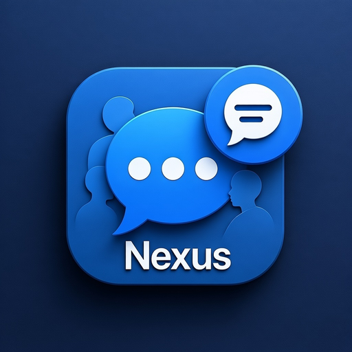
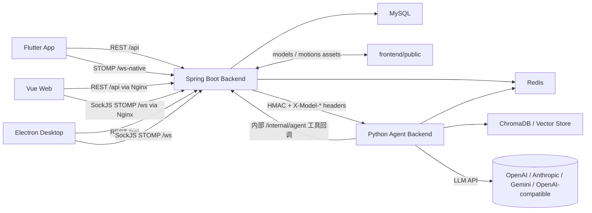

<div align="center">
  
  <h1>Nexus Chat</h1>
  <p><strong>使用Spring Boot、Electron/Vue3和Flutter构建的多客户端实时聊天系统。</strong></p>
</div>

<div align="center">


</div>

## 目录

- [1. 项目整体定位](#overview)
- [2. 根目录协作关系与部署](#workspace)
- [3. Java 后端](#backend)：[3.11 后端开发参考](#backend-reference)
- [4. Python Agent](#agent)
- [5. Web / Electron 前端](#frontend)：[5.11 前端开发参考](#frontend-reference) · [English](nexus-chat-frontend/README_EN.md)
- [6. Flutter App](#app)
- [7. 职责分工对比](#comparison)
- [8. 建议的阅读顺序](#reading-order)

本文保留四模块原有说明，并整合以下历史来源的独有信息：`nexus-chat-backend/README.md`、`nexus-chat-backend/PROJECT_OVERVIEW.md`、`nexus-chat-frontend/README.md`、`nexus-chat-frontend/PROJECT_OVERVIEW.md`。这些路径仅记录合并来源，不再作为文档入口。Agent、Flutter、IM 计划、平台资源与技能文档仍各自保留。

**路径与时效约定**：各模块章节内的 `src/`、`public/`、`electron/`、配置及运行时目录均相对该模块目录；根目录文件会明确标注。命令示例注明工作目录。原有源码规模与“当前观察”是原说明的快照，并非本次全项目审计；合并中确切核实的冲突在开发参考中单独说明。

<a id="overview"></a>
## 1. 项目整体定位

这不是一个单一前端项目，而是一个完整的"即时通讯 + AI Agent"产品工作区，分为四个模块:

| 目录 | 角色 | 主要技术 |
|---|---|---|
| `nexus-chat-backend` | 核心服务端 (Java 网关)，提供鉴权、消息、群组、联系人、社区、AI 陪伴、文件、同步、版本更新、Agent/知识库网关等能力 | Spring Boot 3.2, Java 17, MySQL, Redis, STOMP WebSocket |
| `nexus-agent-backend` | Python Agent 服务，负责 LLM 调用、工具编排、短期/长期记忆、RAG、知识库向量化与检索 | Python 3.10+, FastAPI, LangChain, LangGraph, ChromaDB, Redis, OpenAI / Anthropic / Gemini / OpenAI-compatible |
| `nexus-chat-frontend` | Web + Electron 桌面端主界面，功能最完整 | Vue 3, Pinia, Vite, Element Plus, Electron, Dexie, Three.js |
| `nexus-chat-app` | Flutter 移动端客户端，偏移动场景体验 | Flutter, Dio, STOMP, Hive, SecureStorage, 本地通知 |

可以把它理解成:

- `chat-backend` 是唯一的业务中台和数据源，同时也是 Agent 模块对客户端暴露的网关。
- `agent-backend` 是独立部署的 Python Agent 服务，只对内网/`chat-backend` 开放，通过 HMAC 签名互信。
- `frontend` 是桌面/Web 主客户端，承担最丰富的交互能力，已深度接入 Agent 与知识库。
- `app` 是面向手机的独立客户端，复用后端接口，但 UI 和实现方式完全独立。

<a id="workspace"></a>
## 2. 根目录协作关系

根目录不仅是四个模块的容器，还负责把它们串起来。

### 2.1 部署入口

- `docker-compose.yml`
  - 启动 `mysql + redis + backend + frontend + cloudflared`
  - 适合 Web/Electron 体系的公网发布
- `docker-compose-app.yml`
  - 启动 `mysql + redis + backend`
  - 让手机 App 直接通过公网 IP 访问后端
- `nginx/nginx.conf`
  - 负责 Vue 静态资源
  - 反代 `/api`
  - 反代 `/ws` 和 `/ws-native`
  - 暴露 `/uploads`
- `.env.example`
  - 定义 MySQL、JWT、CORS、邮件、Companion 密钥等运行参数
- `nexus-agent-backend`
  - 当前不在根目录的 docker-compose 里，独立运行 (默认 `:8100`)
  - 由 `nexus-chat-backend` 通过 HMAC 内网调用，无需对客户端直连
  - 历史参考 `agent开发文档/` 当前工作区缺失；现有说明参见 `nexus-agent-backend/README.md` 与本页第 4 章，不假定缺失文档内容可用

### 2.2 整体通信关系


```mermaid
flowchart LR
    A[Flutter App] -->|REST /api| B[Spring Boot Backend]
    A -->|STOMP /ws-native| B
    C[Vue Web] -->|REST /api via Nginx| B
    C -->|SockJS STOMP /ws via Nginx| B
    D[Electron Desktop] -->|REST /api| B
    D -->|SockJS STOMP /ws| B
    B --> E[MySQL]
    B --> F[Redis]
    B <-->|models / motions assets| G[frontend/public]
    B -->|HMAC + X-Model-* headers| H[Python Agent Backend]
    H -->|内部 /internal/agent 工具回调| B
    H --> I[ChromaDB / Vector Store]
    H --> F
    H -->|LLM API| J[(OpenAI / Anthropic / Gemini / OpenAI-compatible)]
```

关键点:

- Web/Electron 走 `/ws`，依赖 SockJS 兼容层。
- Flutter 走 `/ws-native`，直接使用原生 WebSocket STOMP。
- 后端除数据库外，还把 Redis 用在在线状态、未读数、离线消息、消息序号、跨实例转发。
- Companion 3D 资产在本地开发模式下和 `nexus-chat-frontend/public/models`、`public/motions` 直接耦合。
- Agent 调用链是单向闭环: `客户端 → Java 网关 → Python Agent → 反向调用 Java 内部 /internal/agent 工具`。Java 永远不直接调 LLM，Python 也不直接面对客户端。
- Agent 端走 BYOK 模式: 客户端在网关存放 provider/key (加密)，请求时由 Java 通过 `X-Model-*` 头转发到 Python，Python 不持久化用户密钥。

<a id="backend"></a>
## 3. `nexus-chat-backend` 详解

### 3.1 项目定位

`nexus-chat-backend` 是整个产品的业务核心。它不仅负责用户、聊天、群组和文件，还扩展了:

- 社区帖子
- 关注/粉丝
- 增量同步
- App 更新检查
- AI 陪伴角色、记忆、状态、模型绑定
- 3D 模型和动作资源管理
- Agent 会话、长期记忆审计、模型 Provider 凭据
- 知识库 (Knowledge Base) 文档管理与 Python Agent 网关

### 3.2 技术栈与规模

- Spring Boot 3.2.0
- Java 17
- Spring Web / Security / WebSocket / Data JPA / Data Redis / Mail
- MySQL
- Redis
- JWT
- Maven
- 旧后端技术表补充：MySQL 8.0+、JWT 实现 JJWT 0.12.3、Lombok（代码简化）；安装环境见 [3.11.1](#backend-setup)

当前源码规模大致为:

- `183` 个 Java 源文件
- `18` 个 Controller (含 `controller/agent/` 子包下的 4 个 Agent/KB 控制器)
- `24` 个 Service
- `37` 个 Entity/Model
- `37` 个 Repository

### 3.3 目录结构

核心结构如下:

- `src/main/java/com/nexus/chat/NexusChatApplication.java`
  - 应用入口，开启异步和定时任务
- `config/`
  - 安全、CORS、WebSocket、Redis、国际化、限流、消息校验
- `controller/`
  - REST API 入口层
- `service/`
  - 业务逻辑层
- `repository/`
  - JPA 数据访问层
- `model/`
  - 数据实体
- `dto/`
  - 前后端传输对象
- `security/`
  - JWT 鉴权过滤器和 Token Provider
- `websocket/`
  - 实时消息控制器
- `resources/`
  - `application*.properties`、建表 SQL、日志、国际化、迁移脚本
- `exception/`、`util/`
  - 业务异常处理和通用工具
- 模块根 `pom.xml`、`uploads/`、`logs/`、`Dockerfile`
  - Maven 构建、上传文件、运行日志与镜像构建入口

分层调用关系是 `Controller → Service → Repository → Model`；REST 与 WebSocket 并行承载业务。

### 3.4 REST API 能力边界

从 Controller 划分看，这个后端已经不是“纯聊天 API”，而是完整社交产品后端。

#### 认证与用户

- `AuthController`
  - 发送验证码
  - 校验验证码
  - 注册
  - 登录
  - 登出
- `UserController`
  - 用户查询、搜索、推荐
  - 资料读取与更新
  - 头像上传/删除
  - 隐私设置
  - 背景图
  - 社交链接
  - 活动流
  - 资料更新后通过 WebSocket 广播 `USER_PROFILE_UPDATED`

#### 聊天与消息

- `ChatController`
  - 创建私聊
  - 创建群聊
  - 获取用户聊天列表
  - 获取聊天详情
- `MessageController`
  - REST 发送消息
  - 分页获取消息
  - 单条/整聊已读
  - REST 发消息后仍会触发统一 WebSocket 通知

#### 联系人和群组

- `ContactController`
  - 添加联系人或发送好友申请
  - 删除联系人
  - 联系人列表
  - 是否为好友
  - 共同好友
  - 好友申请收件箱/发件箱/数量
  - 接受/拒绝申请
- `GroupController`
  - 群信息、群成员、加人、踢人、退群、解散、管理员、转让群主

#### 社区能力

- `PostController`
  - 发帖、删帖
  - 推荐/热门/最新
  - 用户帖子
  - 搜索
  - 点赞/点踩
  - 收藏
  - 评论、回复、评论点赞
- `FollowController`
  - 关注、取消关注
  - 关注状态
  - 关注列表/粉丝列表

#### 文件与版本

- `FileUploadController`
  - 单文件上传
  - 分片上传
  - MD5 秒传
  - 文件信息
  - 下载
  - 在线预览
- `AppVersionController`
  - `GET /api/app/check-update`
  - 给移动端提供版本号、下载地址、更新日志、强更标记

#### 增量同步

- `SyncController`
  - `GET /api/sync/delta`
  - 按 `since` 时间戳增量同步消息、聊天和联系人
  - 这和桌面端 IndexedDB 离线缓存设计是配套的

#### Companion / AI 陪伴

- `CompanionController`
  - 初始化默认角色
  - 获取/更新角色
  - 获取对话
  - 发送消息
  - 管理记忆
  - 获取成长值和状态
  - 保存模型凭据
  - 绑定模型与 endpoint
- `CompanionAssetController`
  - 上传/重命名 3D 模型
  - 上传/重命名/删除动作文件
  - 读取模型库和动作库

#### Agent 网关 (`controller/agent/`)

这是和 `nexus-agent-backend` 配套的 Java 侧网关层，独立于 Companion 模块。

- `AgentController`  (`/api/agent/*`)
  - 会话管理: 创建/列出/删除会话、拉历史消息
  - 实时对话: `POST /sessions/{id}/chat` 与 `POST /sessions/{id}/chat/stream` (SSE)
  - 长期记忆: 删除会话记忆、删除单条记忆、整体重置
  - 业务原子操作: `chats/{chatId}/summarize`、`todo-extract`、`reply-suggest`、`reply-publish`
- `AgentProvidersController`  (`/api/agent/providers`)
  - 用户的 LLM Provider/Key 管理
  - 设为默认、连通性测试
- `KnowledgeBaseController`  (`/api/agent/knowledge`)
  - 知识库 CRUD
  - 文档上传/列表/删除/状态查询
  - 触发 Python Agent 端的向量化入库
- `InternalAgentController`  (`/internal/agent/*`)
  - 仅供 Python Agent 反向调用，HMAC 鉴权
  - 暴露 `recent-messages / chat-profile / user-profile / by-username / messages / me/chats` 等工具接口
  - `/messages/publish` 让 Agent 代发消息

### 3.5 实时通信架构

这是后端最关键的一层。

#### WebSocket 入口

- `/ws`
  - SockJS STOMP 端点，给 Web/Electron 用
- `/ws-native`
  - 原生 WebSocket 端点，给 Flutter 用

#### STOMP 约定

- Broker 前缀: `/topic`, `/queue`
- 应用前缀: `/app`
- 用户前缀: `/user`

#### 统一用户频道

当前实现的核心思想是:

- 所有实时事件尽量统一投递到 `/topic/user.{userId}.messages`
- 不再以“每个 chat 一个 topic”作为主通信模型

这个频道承载:

- 新消息
- ACK
- 输入中状态
- 已读回执
- 群成员变化
- 通话信令
- 错误事件

#### Redis 在实时层的作用

`RedisCacheService` 和 `RedisMessageRelay` 让 WebSocket 具备了更接近生产系统的能力:

- 在线状态 Presence
  - 90 秒 TTL
  - 客户端每 30 秒发心跳
  - 支持多设备会话
- 离线消息队列
  - 目标用户离线时先写 Redis List
  - 上线后回放
- 输入中状态
  - 5 秒 TTL
- 未读数
- 聊天缓存
- 消息序号
  - 通过 Redis INCR 生成单调递增 `sequenceNumber`
- 跨实例转发
  - 通过 Redis Pub/Sub 广播到其它实例，再由本地实例判断目标用户是否在线

#### 其他实时细节

- `WebSocketAuthChannelInterceptor`
  - WebSocket 优先走 JWT
  - 仍兼容旧式 `userId` 头
- `MessageValidationInterceptor`
  - 文本校验、XSS 清洗、URL 校验
- `WebSocketRateLimiter`
  - 基于 Redis 的限流
- `WebSocketController`
  - 覆盖消息、状态、typing、read receipt、group event、contact event、call signaling

### 3.6 数据模型

原说明依据 `schema.sql` 和 `model/` 列出多种业务域；其中 `schema.sql` 当前工作区缺失（见 3.11.4），以下保留原表名索引，实际结构应结合现有实体与迁移核实。

核心表包括:

- `users`
- `user_privacy_settings`
- `contacts`
- `contact_requests`
- `chats`
- `chat_members`
- `messages`
- `message_read_status`
- `file_uploads`
- `email_verification_codes`（邮箱验证码）

社交和扩展表包括:

- `posts`
- `post_comments`
- `post_votes`
- `post_bookmarks`
- `comment_likes`
- `user_follows`
- `user_social_links`
- `user_security_settings`
- `user_sessions`
- `login_history`
- `user_activities`

Companion 相关表包括:

- `companion_roles`
- `companion_conversations`
- `companion_messages`
- `companion_memories`
- `companion_growth`
- `companion_status`
- `model_credentials`
- `companion_model_bindings`

Agent / 知识库相关表包括:

- `agent_session`
- `agent_session_summary`
- `agent_long_memory`
- `agent_memory_embedding`
- `agent_memory_audit`
- `knowledge_base`
- `knowledge_document`

### 3.7 文件与定时任务

后端不只是保存元数据，文件生命周期也有管理逻辑。

- 上传目录: `uploads/`
- 支持单文件上传和分片合并
- `FileCleanupService`
  - 每天凌晨 3 点清理过期文件
  - 清理未完成上传
  - 清理孤立分片目录

### 3.8 Companion 模块的设计特点

这一块是本项目区别于普通 IM 项目的重点。

- 初始会为用户创建 3 个默认角色
  - 温柔倾听者
  - 理性伙伴
  - 活力陪玩
- 每个角色有:
  - 名称
  - traits
  - tone
  - baseline mood
  - growth
  - status
  - memory
  - conversation history
- 模型调用方式不是写死 OpenAI SDK，而是“OpenAI-compatible endpoint”
  - 客户端保存 provider / model / endpoint
  - 服务端保存并加密 API Key
  - `CompanionModelService` 按 `/v1/chat/completions` 规范请求
- 如果远程模型失败，会回退到 `CompanionFallbackService`

这意味着 Companion 模块本质上是一个“可配置的陪伴型 LLM 中间层”，而不是单纯的前端假 UI。

### 3.9 配置与部署

#### 开发/生产/容器配置

- `application.properties`
  - 本地开发配置
- `application-prod.properties`
  - 生产配置
- `application-docker.properties`
  - 容器环境配置

#### Docker 化

- `Dockerfile` 使用多阶段构建
  - Maven 构建 JAR
  - Temurin 17 JRE 运行
- 运行容器时会创建:
  - `/app/uploads`
  - `/app/apk`

#### 与前端资源目录的耦合

Companion 资产路径有两种模式:

- 本地开发（后端目录为工作目录）: 指向 `../nexus-chat-frontend/public`
- Docker: 指向 `/data/companion-assets`

这说明 Companion 资源管理是“后端可写、前端可直接静态读取”的设计。

### 3.10 当前观察

当前后端实现已经很丰富，但有几处工程信号值得单独记住:

- `application.properties` 和 `application-prod.properties` 中存在硬编码敏感配置，不适合继续保留在仓库里。
- 多个 profile 都在使用 `spring.jpa.hibernate.ddl-auto=update`，上线环境存在 schema 漂移风险。
- 自动化测试基本缺失，`src/test` 下没有有效测试代码。
- WebSocket、Redis、同步、Companion 都已经进入"可运行复杂系统"阶段，但回归保障不足。

<a id="backend-reference"></a>
### 3.11 后端开发参考

本节面向开发、测试、运维与交付，补足第 3.1–3.10 节未展开的操作与索引；不重复其功能总览。

- [环境与命令](#backend-setup) · [REST 路径](#backend-api) · [WebSocket 映射与历史兼容](#backend-websocket)
- [数据与 Redis](#backend-data) · [安全及关键文件](#backend-files) · [来源与许可](#backend-license)

<a id="backend-setup"></a>
#### 3.11.1 环境、安装、构建与测试

环境要求：Java 17 或更高版本（项目基线为 17）、Maven 3.6+、MySQL 8.0+、Redis。先启动 MySQL 与 Redis，再配置并启动 Java 后端，最后启动客户端；使用 Agent 时另外启动第 4.8 节的 Python 服务并配置双向互信。

在 MySQL 客户端创建数据库：

```sql
CREATE DATABASE nexus_chat;
```

编辑根目录下 `nexus-chat-backend/src/main/resources/application.properties`。以下是原安装说明的本地示例，`root/root` 仅用于说明，不应作为生产凭据：

```properties
spring.datasource.url=jdbc:mysql://localhost:3306/nexus_chat
spring.datasource.username=root
spring.datasource.password=root
```

从本仓库根目录进入后端执行（下列构建/测试命令按需选择，不必全部串行执行）：

```bash
cd nexus-chat-backend
mvn clean install       # 安装构建产物到本地 Maven 仓库
mvn spring-boot:run     # 运行，默认 http://localhost:8080
```

```bash
# 工作目录：nexus-chat-backend/
mvn test               # 运行测试；测试覆盖现状见 3.10
mvn clean package      # 打包；生产配置还需选择相应 profile
```

本地、生产、Docker 配置文件及镜像路径见 3.9。Docker 运行镜像为 `eclipse-temurin:17-jre`，默认暴露 `8080`；不要把 Maven 打包成功等同于已完成生产密钥/CORS 配置。

<a id="backend-api"></a>
#### 3.11.2 REST 路径速查

下表保留原后端 API 清单；功能范围与其它 Controller 见 3.4。路径均包含 `/api`，参数、鉴权和响应以对应 Controller 为准，非完整 OpenAPI 文档。

| 模块 | 方法与路径 | 说明 |
|---|---|---|
| 认证 | `POST /api/auth/register` | 注册新用户 |
| 认证 | `POST /api/auth/login` | 登录 |
| 认证 | `POST /api/auth/logout` | 登出 |
| 用户 | `GET /api/users/{id}` | 按 ID 获取用户 |
| 用户 | `GET /api/users/username/{username}` | 按用户名获取用户 |
| 用户 | `GET /api/users` | 获取用户列表 |
| 用户 | `PUT /api/users/{id}/profile` | 更新资料 |
| 用户 | `PUT /api/users/{id}/status` | 更新在线状态 |
| 聊天 | `POST /api/chats/direct` | 创建私聊 |
| 聊天 | `POST /api/chats/group` | 创建群聊 |
| 聊天 | `GET /api/chats/user/{userId}` | 用户聊天列表 |
| 聊天 | `GET /api/chats/{chatId}` | 聊天详情 |
| 消息 | `POST /api/messages` | 发送消息 |
| 消息 | `GET /api/messages/chat/{chatId}` | 分页消息 |
| 消息 | `PUT /api/messages/{messageId}/read` | 单条已读 |
| 消息 | `PUT /api/messages/chat/{chatId}/read` | 整聊已读 |
| 联系人 | `POST /api/contacts` | 添加联系人/好友申请 |
| 联系人 | `DELETE /api/contacts` | 删除联系人 |
| 联系人 | `GET /api/contacts/user/{userId}` | 联系人列表 |
| 文件 | `POST /api/files/upload` | 文件上传 |
| 文件 | `POST /api/files/upload/chunk` | 大文件分片上传 |
| 群组 | `GET /api/groups/{groupId}` | 群详情 |
| 群组 | `PUT /api/groups/{groupId}` | 更新群信息 |
| 群组 | `DELETE /api/groups/{groupId}` | 解散群 |
| 群组 | `GET /api/groups/{groupId}/members` | 群成员 |
| 群组 | `POST /api/groups/{groupId}/members` | 加人 |
| 群组 | `DELETE /api/groups/{groupId}/members/{memberId}` | 移除成员 |
| 群组 | `PUT /api/groups/{id}/members/{memberId}/admin` | 当前设置管理员路径 |
| 群组 | `POST /api/groups/{id}/transfer` | 当前转让群主路径 |

**历史 API 差异**：原清单的 `PUT /api/groups/{groupId}/admin/{memberId}`（设置管理员）和 `PUT /api/groups/{groupId}/owner`（转移群主）仅保留为历史说明，当前 `GroupController` 分别使用上表 `/members/{memberId}/admin` 与 `POST /{id}/transfer`。表内其它群路径的 `{groupId}` 与源码 `{id}` 只是参数命名不同。

<a id="backend-websocket"></a>
#### 3.11.3 WebSocket 映射、消息流与历史主题

连接端点、Broker 前缀、主通道、心跳与 Redis 投递机制见 3.5。客户端向 `/app` 发送，映射如下：

| 目的地 | 说明 |
|---|---|
| `/app/chat.sendMessage` | 发送聊天消息 |
| `/app/user.status` | 更新在线状态 |
| `/app/chat.typing` | 输入状态 |
| `/app/message.read` | 标记已读 |
| `/app/group.create` | 创建群组 |
| `/app/group.join` | 加入群组 |
| `/app/group.leave` | 离开群组 |
| `/app/user.heartbeat` | 用户心跳 |
| `/app/group.message` | 群消息 |
| `/app/contact.add`、`/app/contact.remove` | 联系人操作 |
| `/app/call.signal` | 通话信令 |

消息流：客户端经 `/app/chat.sendMessage` 或 REST `POST /api/messages` 发送 → 服务端用 Redis INCR 生成 `sequenceNumber` → 发送者收到 `MESSAGE_ACK` → 在线成员实时投递、离线成员进入 Redis 队列。当前 REST `MessageController` 也会投递 WebSocket ACK，同时以 HTTP 返回消息结果；两者不是同一个响应通道。消息类型定义在 `src/main/java/com/nexus/chat/dto/WebSocketMessage.java`。

原订阅表保留如下，**不是新客户端的推荐订阅配置**：

| 历史主题 | 原用途 | 本次局部核对 |
|---|---|---|
| `/topic/chat/{chatId}` | 聊天室消息 | `WebSocketController` 已改为统一用户消息通道，不再按聊天室订阅 |
| `/topic/group/{groupId}` | 群组消息 | 当前群消息走用户投递，不作为主订阅 |
| `/topic/users` | 用户状态 | 当前状态通知走用户投递，不作为主订阅 |
| `/queue/chats` | 聊天列表更新 | 前端仍订阅 `/user/queue/chats`；不能去掉用户前缀直接照抄旧表 |
| `/queue/contacts` | 联系人更新 | 后端旧 STOMP 联系人处理仍有 `convertAndSendToUser`；前端当前另订阅 `/topic/user.{userId}.contacts` |
| `/queue/groups` | 群组更新 | 后端旧建群处理仍有用户队列投递，但前端未订阅该队列 |

核对依据为 `config/WebSocketConfig.java`、`websocket/WebSocketController.java`（均在后端 `src/main/java/com/nexus/chat/` 下）与 `nexus-chat-frontend/src/services/websocket.js`。当前前端主订阅是 `/topic/user.{userId}.messages`，附加联系人通道和 `/user/queue/chats`；Broker 仍启用 `/topic`、`/queue`，旧错误处理也仍发送 `/user/queue/errors`。因此“统一通道”是主路径，不代表所有旧队列已清除；旧联系人/群组/错误队列的端到端兼容性待单独验证，本次不改协议或源码。

<a id="backend-data"></a>
#### 3.11.4 数据库、实体与 Redis 键

表名全集沿用 3.6。原核心表的语义为：`users` 用户账户，`chats` 私聊/群聊天室，`chat_members` 参与者，`messages` 消息，`message_read_status` 已读回执，`contacts` 联系人，`contact_requests` 好友请求。辅助表为 `email_verification_codes` 邮箱验证码、`file_uploads` 文件元数据、`login_history` 登录历史、`user_activities` 用户活动、`user_privacy_settings` 隐私设置、`user_social_links` 社交链接。

- 历史数据库基线：`nexus-chat-backend/src/main/resources/schema.sql`，当前工作区缺失；不作为可直接执行的初始化脚本，现有实体与 `migrations/` 可用于核查，不能据此假定已完整还原基线。
- Companion 迁移：`nexus-chat-backend/src/main/resources/migrations/2026_03_13_companion_mvp1.sql`。
- 实体均在后端 `src/main/java/com/nexus/chat/model/`，索引如下：

| 业务域 | 核心实体 |
|---|---|
| 账号 | `User`、`UserPrivacySettings`、`UserSocialLink`、`UserSecuritySettings` |
| 聊天 | `Chat`、`ChatMember`、`Message`、`MessageReadStatus` |
| 联系人 | `Contact`、`ContactRequest` |
| 文件 | `FileUpload` |
| 社区 | `Post`、`PostComment`、`PostVote`、`PostBookmark`、`CommentLike`、`UserFollow` |
| Companion | `CompanionRole`、`CompanionGrowth`、`CompanionMemory`、`CompanionConversation`、`CompanionMessage`、`CompanionModelBinding`、`ModelCredential`、`CompanionStatus` |

| Redis 键/前缀 | 用途 |
|---|---|
| `presence:*`、`presence:sessions:*` | 在线状态与多设备会话 |
| `offline:{userId}` | 用户离线消息队列 |
| `chat:seq:{chatId}` | 消息单调递增序列号 |
| `ratelimit:*` | 消息、输入状态、在线状态等限流 |

用户资料、联系人与聊天列表缓存集中于 `RedisCacheService`；TTL、未读数与跨实例转发详见 3.5。`WebSocketRateLimiter` 在 Redis 故障时采取 fail-open（放行），避免完全不可用，但此时不应假定限流仍有保护效果。

<a id="backend-files"></a>
#### 3.11.5 安全、日志、国际化与关键文件索引

以下 Java 路径相对 `nexus-chat-backend/src/main/java/com/nexus/chat/`：

| 文件/目录 | 作用 |
|---|---|
| `NexusChatApplication.java` | 应用入口，异步与定时任务（3.3） |
| `security/JwtTokenProvider.java` | JWT 签发和验证 |
| `security/JwtAuthenticationFilter.java` | REST 认证过滤 |
| `config/WebSocketAuthChannelInterceptor.java` | STOMP 认证 |
| `config/SecurityConfig.java` | CORS 与权限 |
| `websocket/WebSocketController.java` | 实时入口，映射见 3.11.3 |
| `controller/`、`service/`、`repository/`、`model/` | API、业务、JPA 与实体索引（3.3–3.6） |
| `service/CompanionService.java` | 角色与成长 |
| `service/CompanionModelService.java` | OpenAI-compatible 模型调用（3.8） |
| `service/CompanionCryptoService.java` | AES-GCM 密钥加密 |
| `service/CompanionFallbackService.java` | 模型失败兜底 |
| `controller/CompanionAssetController.java` | VRM/FBX 与 `motions.json` 资产管理 |
| `config/WebMvcConfig.java` | 暴露静态访问 `/uploads/**` |
| `exception/BusinessException.java`、`exception/GlobalExceptionHandler.java` | 业务异常与统一处理 |

配置资源位于 `nexus-chat-backend/src/main/resources/`：`application*.properties` 见 3.9，`logback-spring.xml` 配置日志，`i18n/messages*.properties` 提供国际化。文件上传/分片、MD5 秒传、每天凌晨 3 点清理见 3.4 与 3.7，运行目录为后端 `uploads/`，不是本 README 所在目录的同名路径。

生产环境必须更换默认 JWT 密钥，使用环境变量覆盖 JWT、邮箱密码、API Key 加密密钥等敏感项，不复制示例明文凭据。开发 CORS 已开放相应来源，生产必须按实际域名配置 REST 与 WebSocket 的允许来源；SockJS 回退只解决浏览器兼容性，不替代鉴权。其它已知风险保留在 3.10。

<a id="backend-license"></a>
#### 3.11.6 原项目地址与许可声明

原后端说明关联的前端项目为 [AngkinV/Nexus-Chat](https://github.com/AngkinV/Nexus-Chat)，并声明“本项目基于 MIT 许可证开源”。根目录 `LICENSE` 当前缺失，不应将原来的相对链接迁移成不存在的根文件链接；本次只读核对发现子模块 `nexus-chat-backend/LICENSE` 与 `nexus-chat-frontend/LICENSE` 实际存在，内容为 MIT License、`Copyright (c) 2026 AngkinV`。本次未新建或修改许可文件，也不推定其它模块自动适用该声明。

<a id="agent"></a>
## 4. `nexus-agent-backend` 详解

### 4.1 项目定位

`nexus-agent-backend` 是 Nexus 的 Agent 中台，独立于 Java 网关运行的 Python 服务。

它承担:

- LLM 调用 (OpenAI / Anthropic / Gemini / OpenAI-compatible 多家)
- 工具编排 (ReAct + 反向回调 Java 内部接口)
- 短期记忆 (Redis) + 长期记忆 (RAG)
- 知识库文档入库与向量检索 (ChromaDB)
- 流式输出 (SSE)
- 双引擎: 手写 ReAct 与 LangGraph StateGraph 可热切换

它不直接对外，所有客户端流量先到 Java 网关 `/api/agent/*`，再经 HMAC 内部调用进入 Python。

### 4.2 技术栈与规模

- Python 3.10+
- FastAPI 0.115 + uvicorn
- pydantic v2 / pydantic-settings
- httpx (异步)
- redis (短期记忆 / 限流)
- openai SDK (兼容 DeepSeek / Moonshot / Groq / DashScope 等)
- LangChain 0.3 + LangChain Community / Chroma / OpenAI / TextSplitters
- LangGraph 0.2 (备选编排引擎)
- ChromaDB 0.5 (本地持久化向量库)
- structlog (结构化日志)
- pypdf / unstructured / python-docx / docx2txt / markdown (Module B 文档加载器)
- pytest + pytest-asyncio

源码规模大致为:

- `46` 个 Python 文件 (`app/` + `tests/` + `main.py`)
- `16` 个测试文件 (RAG / 工具 / 路由 / 编排器 / mock 全覆盖)
- 2 套编排引擎 (`orchestrator.py` 手写 + `orchestrator_langgraph.py`)
- 4 个 LLM Client 适配 (`openai_like` / `anthropic_client` / `gemini_client` + `factory`)
- 6 个 Embedding Provider 预设 (OpenAI / DashScope / Zhipu / SiliconFlow / Ollama / NewAPI)

### 4.3 目录结构

```
nexus-agent-backend/
├── main.py                  # uvicorn 启动入口
├── requirements.txt
├── pytest.ini
├── README.md
├── data/
│   └── chroma/              # ChromaDB 持久化
├── app/
│   ├── __init__.py          # FastAPI app 工厂
│   ├── config.py            # 环境变量 + Embedding Provider 预设
│   ├── routes.py            # /v1/agent/* 与 /v1/knowledge/* 路由
│   ├── schemas.py           # Pydantic 请求/响应模型
│   ├── security.py          # HMAC 签名校验依赖
│   ├── memory.py            # Redis 短期记忆
│   ├── prompts.py           # 系统/业务 prompt + 注入清洗
│   ├── tools.py             # Tool Schema + 反向调用 Java 的执行器
│   ├── langchain_tools.py   # LangChain 适配的工具封装
│   ├── orchestrator.py      # 手写 ReAct 编排
│   ├── orchestrator_langgraph.py  # LangGraph StateGraph 编排
│   ├── mock.py              # 无 OpenAI Key 时的确定性回复
│   ├── sse.py               # SSE 帧封装
│   ├── llm/                 # LLM Client 抽象与多家实现
│   ├── rag/                 # 向量库、Embedding、记忆 RAG、知识库 RAG
│   └── knowledge/           # 文档加载、切片、入库、QA
└── tests/                   # pytest 测试集
```

### 4.4 对外接口

所有路由都依赖 `verify_internal_signature` HMAC 校验，仅供 Java 内部调用。

#### Agent 调用

- `GET  /v1/agent/health`
  - 健康检查，返回当前 provider / model / engine
- `POST /v1/agent/invoke`
  - 同步调用，一次返回最终结果 (含 token usage)
- `POST /v1/agent/invoke/stream`
  - SSE 流式输出，事件类型: `meta / tool_call / tool_result / delta / usage / done / error`

#### 知识库 (Module B)

- `POST /v1/knowledge/ingest`
  - 同步入库: 加载 → 切分 → 向量化 → 写 ChromaDB
  - 失败返回 502 + 短原因，匹配 Java 侧 `agent_knowledge_document.error_message` 字段
- `POST /v1/knowledge/delete`
  - 删除 KB 全量 (docId=null) 或单文档
- `POST /v1/knowledge/query`
  - Top-K 相似度检索，永远返回 200，空结果交给 Java 渲染"我不知道"

### 4.5 编排器与工具

#### 双引擎可切换

通过 `ENGINE` 环境变量切换:

- `handcrafted` (默认): `orchestrator.py` 手写 ReAct loop
- `langgraph`: `orchestrator_langgraph.py` 基于 LangGraph StateGraph

两套引擎产出同样的 `Event` 序列，所以 SSE 线格式与引擎无关。

#### 工具 (反向调用 Java)

`TOOL_SCHEMAS` 当前注册了 7 个工具，全部由 `ToolExecutor` 通过 HMAC + Bearer 调到 `nexus-chat-backend` 的 `/internal/agent/*`:

- `get_recent_messages`
- `get_chat_profile`
- `get_user_profile`
- `get_message_by_id`
- `find_user_by_username`
- `list_my_chats`
- `find_direct_chat_with_user`

特定操作 (如 `CHAT_SUMMARY`, `TODO_EXTRACT`) 强制要求至少调用 `get_recent_messages`，避免幻觉。

### 4.6 记忆与 RAG

#### 短期记忆 (Redis)

- 默认 7 天 TTL
- 单会话保留最近 20 轮
- 上下文预算: `context_max_tokens = 12000`，最近 6 轮强制保留

#### 长期记忆 (Module A: memory RAG)

- 写入门槛: `memory_write_confidence_threshold = 0.75`
- 检索 Top-K = 3
- 入向量库后异步写出，主线程不阻塞 (`_pending_rag_writes` 强引用防 GC)

#### 知识库 (Module B: knowledge RAG)

- 默认切片 512 / overlap 64
- Top-K = 4
- 文档加载支持 PDF / DOCX / TXT / MD
- 入库失败上报 Java，状态写到 `knowledge_document` 表

### 4.7 Provider 与 BYOK 设计

Agent 端走 BYOK (Bring Your Own Key):

- 客户端在 Java `AgentProvidersController` 录入 provider/key (Java 加密落库)
- Java 调 Python 时通过 `X-Model-*` 头转发，Python 不持久化用户 Key
- 没有 Key 时回退到 `app.mock.mock_answer` 的确定性输出，本地开发不烧钱

Embedding 走独立 Provider 通道 (因为很多便宜的 chat 厂商不出 embedding):

- `EMBEDDING_PROVIDER` 一行切换 OpenAI / DashScope / Zhipu / SiliconFlow / Ollama / NewAPI
- `EMBEDDING_*` 显式变量永远优先于预设

### 4.8 配置与运行

环境变量（节选；原引用 `agent开发文档/Agent 设计说明.md` §15 为历史参考，当前工作区缺失，无法在此核实完整列表）：

- `SERVICE_PORT` (默认 8100)
- `INTERNAL_SIGNING_SECRET` / `JAVA_INTERNAL_TOKEN` / `JAVA_INTERNAL_BASE_URL` (与 Java 双向互信)
- `OPENAI_API_KEY` / `OPENAI_BASE_URL` / `MODEL_NAME` (本地兜底用)
- `REDIS_URL` (默认 `redis://localhost:6379/2`)
- `CHROMA_PERSIST_DIR` (默认 `./data/chroma`)
- `EMBEDDING_PROVIDER` + `EMBEDDING_*` 或各 Provider 预设变量
- `ENGINE` (`handcrafted` | `langgraph`)
- `MEMORY_RAG_ENABLED` / `KNOWLEDGE_RAG_ENABLED` 等开关

启动:

```bash
cd nexus-agent-backend
python3 -m venv .venv && source .venv/bin/activate
pip install -r requirements.txt
python main.py        # 默认 :8100
# 或: uvicorn app:app --port 8100
```

测试:

```bash
pytest tests/
```

### 4.9 当前观察

- Agent 端工程化程度高: 双编排引擎、SSE、HMAC、BYOK、Embedding 多供应商预设、RAG 双模块都已具备。
- 仓库未提供 `Dockerfile`，目前仅以 `python main.py` 形式部署，未纳入根目录 `docker-compose`。
- 测试覆盖比 Java/前端都好 (16 个测试文件，覆盖 RAG / 路由 / 编排 / mock)。
- LangGraph 引擎是备选项，生产路径仍是手写 ReAct。
- 原说明称设计文档完整放在仓库根 `agent开发文档/` 且与实现一一对应；该目录当前工作区缺失，此处只保留历史参考，不再保证文档完整性或对应关系。

<a id="frontend"></a>
## 5. `nexus-chat-frontend` 详解

### 5.1 项目定位

`nexus-chat-frontend` 是当前功能最完整、体验最丰富的客户端实现。

它同时服务两种运行形态:

- 浏览器 Web 版
- Electron 桌面版

它并不是简单共享 UI，而是显式处理了:

- Web/Electron 路由模式差异
- 原生窗口控制
- 托盘
- 通知
- 桌面端媒体权限
- GitHub Release 更新检查

### 5.2 技术栈与规模

- Vue 3 + Composition API（原技术标识为 3.4.0）
- Pinia
- Vue Router 4
- Element Plus（原技术标识为 2.5.0）
- Vite 5（原技术标识为 5.0.0）
- Electron 28（原技术标识为 28.0.0）
- Axios
- STOMP.js + SockJS
- Dexie / IndexedDB
- Three.js + `@pixiv/three-vrm`
- Vue i18n（中英文界面）与 WebRTC（音视频通话）

源码规模大致为:

- `6` 个视图页面
- `25` 个组件
- `6` 个 Pinia Store
- `6` 个 Service
- `58` 个 `src + electron` 文件

### 5.3 启动入口和路由

关键入口:

- `src/main.js`
  - 挂载 Pinia、Router、Element Plus、i18n
- `src/App.vue`
  - 基础容器，启动时从 `localStorage` 恢复用户
- `src/router/index.js`
  - Electron 用 `HashHistory`
  - Web 用 `History`
  - 路由守卫基于本地 `token`

页面路由包括:

- `/login`
- `/setup`
- `/main`
- `/settings`
- `/profile`
- `/user/:id`

其中 `/setup` 看起来更像早期或辅助流程页面，因为当前真实登录流程主要仍由 `/login` 驱动。

### 5.4 主界面布局

`Main.vue` 是桌面/网页主工作台，结构非常清晰:

- `LeftPanel`
  - 聊天/联系人/群组三标签
  - 搜索
  - 设置入口
  - 新建群聊、添加联系人
  - Electron 下的窗口控制按钮
- `MiddlePanel`
  - 当前会话头部
  - 消息列表
  - 输入区
  - 音视频呼叫入口
- `RightPanel`
  - 私聊资料 / 群资料 / 群成员管理 / 搜索历史 / 置顶静音等
- `CompanionAvatar3D`
  - 右下角 3D 陪伴挂件
- `CompanionPanel`
  - 可拖拽、可缩放的陪伴操作窗
- 通话组件
  - `IncomingCallModal`
  - `OutgoingCallModal`
  - `CallView`
  - `CallEndModal`

整体上，这个前端的核心体验是“即时通讯主界面 + 陪伴组件 + 桌面壳能力”的组合。

### 5.5 状态管理设计

Pinia Store 划分比较成熟:

- `user.js`
  - 登录、登出、资料、背景、隐私、社交链接
- `chat.js`
  - 会话列表、当前会话、置顶、静音、未读数
- `message.js`
  - 按 chatId 管理消息
  - 临时消息替换
  - ACK 后合并
  - typing 状态
- `contact.js`
  - 联系人、好友申请、推荐用户、共同好友
- `call.js`
  - 通话状态机
  - 来电/去电/响铃/连接中/已接通/结束
  - 对接 WebRTC 与 WebSocket 信令
- `companion.js`
  - 角色、消息、记忆、成长值、状态、模型凭据、模型绑定

这一层说明桌面端已经不再是“简单 API 调用器”，而是完整的前端状态机。

### 5.6 Service 层设计

#### `api.js`

统一封装了后端 REST 接口:

- auth
- user
- chat
- message
- contact
- group
- sync
- companion
- file

它还提供了 `resolveFileUrl()`，把 `/uploads/...` 之类的相对地址转成后端完整地址。

#### `websocket.js`

这是前端实时能力的中心。

关键特点:

- 使用 SockJS + STOMP
- 连接后订阅统一频道 `/topic/user.{userId}.messages`
- 同步处理:
  - 聊天消息
  - ACK
  - 投递失败
  - typing
  - 已读
  - 群事件
  - 联系人事件
  - 通话信令
- 内置重连、心跳、页面可见性处理
- 维护 pending ACK 映射，支持“乐观消息 -> 服务端确认”流程

#### `db.js` + `offlineStore.js`

前端实现了本地离线缓存:

- IndexedDB 名称: `NexusChatDB`
- 表:
  - `messages`
  - `chats`
  - `contacts`
  - `syncMeta`
  - `pendingMessages`

这意味着它不是“断网即废”的薄前端，而是有明显的离线优先设计。

`src/services/db.js` 已核实存在且被 `offlineStore.js` 使用，不是失效路径；离线入队闭环仍有限制，详见 [5.11.7](#frontend-limitations)。

#### `syncService.js`

和后端 `SyncController` 配套，实现:

- 根据最后同步时间拉取增量
- 合并消息、聊天、联系人
- 刷新本地 Dexie
- 重连后刷出待发送消息

这套逻辑和微信式“先开 UI，再连 WS，再补 delta，再冲离线消息”的思路一致。

#### `webrtc.js`

负责:

- 音视频采集
- RTCPeerConnection
- SDP offer/answer
- ICE candidate
- 连接状态管理

和 `call.js` + `websocket.js` 配合完成桌面端通话能力。

### 5.7 Companion / 3D 能力

这是前端差异化最强的模块。

#### 入口

- `components/companion/CompanionAvatar3D.vue`
- `components/companion/CompanionPanel.vue`

#### 功能特点

- 支持加载:
  - VRM
  - GLB/GLTF
  - FBX
- 支持 `motions.json` 配置动作库
- 支持本地模型导入、动作导入、重命名、切换
- 支持 Mixamo 动作重定向到 VRM humanoid
- Companion Panel 中还集成:
  - 对话
  - 记忆管理
  - 成长值查看
  - 3D 模型设置
  - OpenAI-compatible 模型凭据与绑定

`public/models` 与 `public/motions` 存放默认资源，这些目录和后端 Companion 资源管理接口是联动的。

### 5.8 Electron 层实现

`electron/main.js` 和 `preload.js` 说明桌面版不是单纯 WebView 包装，而是显式补了原生能力:

- 窗口创建
  - macOS 使用 `hiddenInset`
  - Windows/Linux 使用无边框窗口
- 托盘
- 原生通知
- 始终置顶
- 外链打开
- 媒体权限申请
- GitHub Release 更新检查
- preload 桥接 `electronAPI`

在 Vue 端，`LeftPanel`、`Settings.vue`、`TitleBar.vue`、通话组件等都直接使用了这个桥。

### 5.9 环境配置与部署

环境文件:

- `.env.development`
  - 本地 `http://localhost:8080/api`
- `.env.production`
  - `/api` + 指定 WebSocket 地址
- `.env.electron`
  - Electron 标记和生产服务地址

`vite.config.js` 会根据是否 Electron 切换 `base` 和路由模式。

`Dockerfile` 则采用:

- Node 20 Alpine 构建前端
- Nginx Alpine 运行静态资源

根目录 `nginx/nginx.conf` 最终负责把 Web 资源和后端 API/WS 串起来。

### 5.10 当前观察

- 桌面/Web 端是当前三者中工程完成度最高的一端。
- Companion、通话、离线缓存、增量同步都已具备明确实现，不是占位目录。
- `Setup.vue` 仍带有较强的本地 mock 色彩，和当前真实鉴权主线不完全一致，像遗留/过渡页面。
- 原说明记录工作区含 `dist`、`dist-electron`、`node_modules`，反映“开发现场快照”而非严格瘦身版源码；构建产物与缓存可被独立清理，其存在性不作为使用前提。
- 项目级测试基本缺失。

<a id="frontend-reference"></a>
### 5.11 前端开发参考

本节补足前端原说明中的运行命令、索引与限制。除特别写明外，路径相对 `nexus-chat-frontend/`；运行平台包括 Web 浏览器及 Windows、macOS、Linux 桌面端，已有打包脚本重点覆盖 macOS/Windows。

- [环境、命令与配置](#frontend-setup) · [目录及页面索引](#frontend-pages) · [组件索引](#frontend-components)
- [启动与消息流](#frontend-flow) · [通话](#frontend-calls) · [存储、资源及主题](#frontend-resources)
- [历史限制核对](#frontend-limitations) · [原项目、署名与许可](#frontend-license)

<a id="frontend-setup"></a>
#### 5.11.1 环境、安装、构建与配置

原环境要求：Node.js >= 18.0.0、npm >= 9.0.0。后端启动顺序见 3.11.1；本仓库的前端依赖与命令必须在子目录运行：

```bash
# 从本仓库根目录开始
cd nexus-chat-frontend
npm install
npm run dev:web             # 仅 Web 开发服务器
# 或：
npm run dev                 # Web + Electron 联调
```

```bash
# 工作目录：nexus-chat-frontend/；按目标选择
npm run build               # Web 生产构建
npm run electron:build      # Electron 构建
npm run electron:build:mac  # macOS 打包
npm run electron:build:win  # Windows 打包
```

历史独立前端仓库的获取命令仍保留，但**不要在本工作区重复克隆来代替进入子目录**；该仓库的实际目录结构需以其版本为准：

```bash
# 仅用于另行获取历史独立前端仓库
git clone https://github.com/AngkinV/Nexus-Chat.git
cd Nexus-Chat
# 原独立仓库在此执行 npm install / npm run dev:web / npm run dev
```

环境文件 `.env.development`、`.env.production`、`.env.electron` 的职责见 5.9；本地配置示例：

```env
# nexus-chat-frontend/.env.development
VITE_API_BASE_URL=http://localhost:8080/api
VITE_WS_URL=http://localhost:8080/ws
```

`VITE_API_BASE_URL` 是 REST 基础地址，`VITE_WS_URL` 是 SockJS 地址；原说明的默认值如上。`vite.config.js` 通过 `__IS_ELECTRON__` 控制路由模式与 `base`。Docker 使用 `node:20-alpine` 构建、`nginx:alpine` 运行，支持以构建 `ARG` 设置上述两个变量，部署关系见 2.1 与 5.9。`package.json` 未定义测试脚本，本次不虚构 `npm test`，测试现状见 5.10。

<a id="frontend-pages"></a>
#### 5.11.2 目录、入口、页面与状态索引

| 路径 | 用途 |
|---|---|
| `src/` | Vue 主代码 |
| `src/main.js`、`src/App.vue`、`src/router/index.js` | 应用入口、根组件、路由/鉴权（5.3） |
| `src/views/` | 页面视图 |
| `src/components/` | 组件库；含 `chat/`、`contact/`、`layout/`、`common/` 等 |
| `src/stores/` | Pinia Store（5.5） |
| `src/services/` | API、WebSocket、WebRTC、离线与同步（5.6） |
| `src/styles/`、`src/locales/` | 主题样式、国际化 |
| `electron/` | 主进程与 preload（5.8） |
| `public/` | 图标、3D 模型与动作 |
| `dist/`、`dist-electron/` | Web 与 Electron 构建产物，可重新生成 |

`src/main.js` 除挂载插件外会注册全部 Element Plus 图标；`src/App.vue` 在挂载时读取本地 `token` 恢复用户态。路由守卫对 `meta.requiresAuth` 路由检查令牌，Hash/History 区分见 5.3。

| 页面 | 原说明中的职责 |
|---|---|
| `src/views/Login.vue` | 登录/注册合一、邮箱验证码、注册头像上传 |
| `src/views/Setup.vue` | 本地初始化，写本地用户与 `token`；历史演示/过渡流程，非真实后端鉴权替代品 |
| `src/views/Main.vue` | 聊天主工作台、通话与 Companion（布局见 5.4） |
| `src/views/Settings.vue` | 语言、通知、隐私、Electron 更新检测、登出 |
| `src/views/Profile.vue` | 个人总览、统计、社交与安全 |
| `src/views/UserProfile.vue` | 他人资料、隐私控制、互相关系、发起聊天 |

Store 文件均在 `src/stores/`，六个 Store 的基本职责见 5.5。补充细节：`chat.js` 还管理群聊和在线状态；`message.js` 按服务端 id 与 `clientMsgId` 去重并更新已读/投递状态；`contact.js` 支持增量合并；`call.js` 还负责音视频控制、铃声与超时。Service 文件均在 `src/services/`，六项服务索引见 5.6；`webrtc.js` 另外提供权限检查、Electron 系统媒体权限请求和统计，`db.js` 的有效性见 5.11.7。

<a id="frontend-components"></a>
#### 5.11.3 组件索引与消息/文件类型

以下路径相对 `nexus-chat-frontend/src/components/`。布局组件 `layout/LeftPanel.vue`、`layout/MiddlePanel.vue`、`layout/RightPanel.vue` 的导航/搜索、发送/通话、详情/群管理/置顶静音职责已在 5.4 展开；其它索引如下：

| 组件 | 职责 |
|---|---|
| `chat/ChatList.vue` | 聊天列表与滑动置顶/删除操作 |
| `chat/MessageList.vue` | 文本、图片、视频、音频、文件渲染 |
| `chat/MessageInput.vue` | 输入与文件上传联动 |
| `chat/CreateGroupModal.vue` | 建群与群头像上传 |
| `chat/AddGroupMemberModal.vue` | 添加群成员 |
| `chat/SearchMessagesModal.vue` | 消息搜索高亮；原说明描述为本地搜索，实际检索来源以实现为准 |
| `chat/GroupList.vue` | 群列表与状态 |
| `contact/ContactList.vue` | 联系人与好友申请展示 |
| `contact/AddContactModal.vue` | 用户搜索、直接添加、推荐列表 |
| `contact/ContactRequestList.vue` | 好友申请收件/发件对话框 |
| `call/IncomingCallModal.vue`、`call/OutgoingCallModal.vue`、`call/CallView.vue`、`call/CallEndModal.vue` | 来电、去电、通话、结束界面（5.11.5） |
| `companion/CompanionAvatar3D.vue`、`companion/CompanionPanel.vue`、`companion/CompanionWidget.vue` | 3D 伙伴、面板和挂件；模型/动作、表情、记忆/成长及凭据绑定见 5.7 |
| `profile/SocialModule.vue` | 社交链接管理、在线好友与动态 |
| `profile/AccountSecurityModule.vue` | 安全与登录会话；“示例数据”旧限制已变化，见 5.11.7 |
| `common/EditProfileModal.vue` | 资料编辑与背景图设置 |
| `common/FileUpload.vue` | 文件直传/分片、进度弹窗 |
| `common/TitleBar.vue` | Electron 自定义标题栏 |

消息类型包括 `TEXT`、`IMAGE`、`VIDEO`、`AUDIO`、`FILE`；文件支持小文件直传与大文件分片，原说明默认切片为 5MB。群组管理员设置、联系人在线状态、资料头像/背景/社交链接、历史消息搜索均由上述页面与组件配合完成。

<a id="frontend-flow"></a>
#### 5.11.4 启动顺序、实时流、离线与 API 前缀

`src/views/Main.vue` 的四阶段启动顺序：

1. 从 IndexedDB 载入聊天/联系人缓存，让 UI 立即可用。
2. 连接 WebSocket 并订阅统一消息通道，减少消息丢失窗口。
3. 连接成功后并行拉取聊天、联系人、好友申请，并执行 Delta Sync；同时初始化通话与 Companion。
4. 调用 `syncService.flushPendingMessages()` 补发已有 outbox；这不代表 UI 的离线入队闭环已完成，限制见 5.11.7。

实时主通道与兼容队列见 3.11.3、5.6。原关键事件例举为 `CHAT_MESSAGE`、`MESSAGE_ACK`、`MESSAGE_DELIVERED`、`TYPING`、`MESSAGE_READ`，另有群组与通话事件。`websocket.sendMessage()` 携带 `clientMsgId`；`MESSAGE_ACK` 调用 `messageStore.updateMessageByClientMsgId` 更新临时消息。`chatStore.totalUnreadCount` 聚合未读数，驱动左栏 Tab 提示。

`syncService.performDeltaSync()` 使用 `/sync/delta` 拉取变更并合并至 IndexedDB 和 Pinia；`offlineStore` 对 `db.pendingMessages` 的封装支持离线待发记录，重连后的 flush 处理见限制说明。本地库名称与五张表见 5.6，不重复建第二份 Schema。

以下为前端 `src/services/api.js` 使用的 API 相对路径（基础地址已含 `/api`，例如 `/sync/delta` 的完整服务端路径是 `/api/sync/delta`）：

| 模块 | 相对路径示例 |
|---|---|
| 认证 | `/auth/*` |
| 用户 | `/users/*`、`/users/{id}/profile`、`/users/{id}/social-links` |
| 聊天/群组 | `/chats/*`、`/groups/*` |
| 消息 | `/messages/*` |
| 联系人/申请 | `/contacts/*`、`/contacts/requests/*` |
| 同步 | `/sync/delta` |
| Companion/资产 | `/companion/*`、`/companion/assets/*` |
| 文件 | `/files/*` |

<a id="frontend-calls"></a>
#### 5.11.5 通话状态与信令

`src/stores/call.js` 的 `CallStatus` 为 `idle/ringing/calling/connecting/connected/ended`。信令事件保留完整清单：

- `CALL_INVITE`、`CALL_ACCEPT`、`CALL_REJECT`、`CALL_CANCEL`
- `CALL_BUSY`、`CALL_TIMEOUT`、`CALL_END`
- `CALL_OFFER`、`CALL_ANSWER`、`CALL_ICE_CANDIDATE`

四个通话组件见 5.11.3，媒体采集、SDP、ICE 与连接管理见 5.6。原 WebRTC 说明使用 Google STUN，并提示生产引入 TURN；只有 STUN 不保证复杂 NAT/防火墙环境下可接通，TURN 配置与端到端通话仍需部署时验证。

<a id="frontend-resources"></a>
#### 5.11.6 本地存储、国际化、主题与静态资源

| localStorage Key | 用途 |
|---|---|
| `token` | 登录态令牌 |
| `user` | 用户资料缓存 |
| `mutedChats` | 静音聊天 ID 列表 |
| `pinnedChats` | 置顶聊天 ID 列表 |
| `locale` | 语言选择 |
| `companionPos` | 3D 伙伴位置 |
| `companionModelOverrides` | 伙伴模型本地覆盖 |

国际化入口为 `src/locales/i18n.js`，语言包为 `src/locales/en.json`、`src/locales/zh.json`，在 `src/views/Settings.vue` 选择语言。

主题使用 CSS 变量，`src/styles/nexus-theme.css` 提供默认主题，支持 `[data-theme="dark"]`。旧说明列出的另一套 `src/styles/telegram-theme.css` 当前缺失，不能作为可用资源引用。旧说明还称 `index.html` 引入 Material Icons Round；当前改由 `src/main.js` 导入 `@fontsource/material-icons-round`，`index.html` 不再有该字体引用。

| 根目录下资源路径 | 用途/浏览器路径 |
|---|---|
| `nexus-chat-frontend/public/icons/` | 应用图标；本 README 顶部图标使用该目录 `icon.png` |
| `nexus-chat-frontend/public/models/` | VRM 等角色模型；默认模型 `/models/SpringSnow.vrm`，上传/切换见 Companion Panel |
| `nexus-chat-frontend/public/motions/` | FBX 动作文件 |
| `nexus-chat-frontend/public/motions/motions.json` | 动作清单 |

3D 加载、Mixamo 重定向、表情与模型绑定见 5.7；后端资源路径耦合见 3.9。Electron 的 `electron/preload.js` 向 `window.electronAPI` 暴露窗口、通知、媒体权限和更新接口；更新检测读取 GitHub Releases 的 `latest` 信息，托盘等能力见 5.8。

<a id="frontend-limitations"></a>
#### 5.11.7 历史限制与本次局部核对

- **安全会话示例已变化**：原说明称 `AccountSecurityModule.vue` 包含安全/登录会话演示数据。当前该组件调用 `securityAPI.getSessions/getLoginHistory/getSecuritySettings` 读取数据，并调用 `revokeSession/revokeOtherSessions` 撤销会话；请求失败回退为空列表/默认状态，不是静态会话演示。此结论只说明现有源码接入情况，不等同于已完成安全审计或线上验证。
- **Setup 仍有历史演示限制**：本地初始化用户/token 的旧流程保留，不能据此宣称已通过真实后端认证；参见 5.3、5.10。
- **offline outbox 仍未完成入队闭环**：`src/services/offlineStore.js` 提供 `queuePendingMessage()`、读取、标记与清理接口，`src/services/syncService.js` 有 `flushPendingMessages()`，`Main.vue` 在连接回调中调用它；但本次在 `src/` 检索仅发现 `queuePendingMessage` 定义，没有业务调用点。因此旧说明“实际入队逻辑可继续补齐”仍成立，不能承诺断网发送自动持久化和完整重试。IndexedDB 不可用时 flush 直接跳过；消息标识在补发链路中的保持及 ACK 闭环需另行端到端核实。
- **`db.js` 并未缺失**：`src/services/db.js` 实际存在，以 Dexie 定义 `NexusChatDB` 及 5.6 所列五张表，`offlineStore.js` 使用它。旧表格把 `offlineStore.pendingMessages` 写成成员只是队列概念，实际表在 `db.pendingMessages`。
- **主题/字体旧路径已变化**：`telegram-theme.css` 当前缺失；Nexus 主题与字体入口核对结果见 5.11.6。保留旧文件名以供历史追踪，不假造文件或补链。

<a id="frontend-license"></a>
#### 5.11.8 原项目、署名与许可

- 原前端仓库：[AngkinV/Nexus-Chat](https://github.com/AngkinV/Nexus-Chat)。
- 原“相关项目”中的后端地址：[Nexus Backend / AngkinV/nexus](https://github.com/AngkinV/nexus)。
- 原署名：**Made with ❤️ by Nexus Team**。
- 原前端声明：“本项目基于 MIT 许可证开源”。根 `LICENSE` 缺失与实际存在的子模块许可文件区分见 3.11.6；本次不新建许可证，不将旧相对链接误指向根文件。
- 前端英文说明仍保留在 [README_EN](nexus-chat-frontend/README_EN.md)，此次仅修改其中中文入口，英文其它内容未现代化。

<a id="app"></a>
## 6. `nexus-chat-app` 详解

### 6.1 项目定位

`nexus-chat-app` 是 Flutter 移动端客户端，承担:

- 登录/快速登录
- 消息与会话列表
- 联系人和好友申请
- 群聊
- 社区帖子
- 个人中心与设置
- 本地通知和应用内横幅通知

它不是前端的 WebView，也不是 Electron 共用 UI，而是一套完全独立的移动端代码。

### 6.2 技术栈与规模

- Flutter
- Dio
- STOMP Dart Client
- Hive
- Flutter Secure Storage
- Flutter Local Notifications
- Cached Network Image
- Image Picker / Cropper

源码规模大致为:

- `55` 个 `lib` 文件
- `25` 个页面文件
- `4` 个 Repository
- `7` 个远程 API Service
- `6` 组模型定义目录

需要特别指出:

- `pubspec.yaml` 声明了 `flutter_riverpod`、`riverpod_annotation`、`go_router`
- 但当前 `lib/` 内基本没有真正使用这些依赖
- 实际代码仍然以 `StatefulWidget + Repository + Navigator.push` 为主

也就是说，移动端的架构目标和现状之间还有一段距离。

### 6.3 代码分层

移动端采用比较标准的三层结构:

- `core/`
  - 配置、网络、通知、状态管理、安全存储
- `data/`
  - `datasources/remote`
  - `models`
  - `repositories`
- `presentation/`
  - 页面与通用组件

这是目前三个项目里最清晰的“分层式”目录组织。

### 6.4 应用启动流程

`main.dart` 做了几件关键事:

- 初始化 Hive
- 初始化 `UserStateManager`
- 初始化 `MessageService`
- 锁定竖屏
- 设置系统 UI 样式

`app.dart` 里:

- 设置 `MaterialApp`
- 注册全局 `navigatorKey`
- 配置亮暗主题
- 启动到 `SplashPage`

### 6.5 登录与导航流程

当前主导航是手写的，不是 `go_router`。

实际流程是:

- `SplashPage`
  - 检查是否已登录
  - 检查是否有“记忆账号”
- 如果会话有效
  - 进入 `MainNavigationPage`
- 如果无有效会话但有记忆账号
  - 进入 `QuickLoginPage`
- 否则
  - 进入 `LoginPage`

这套流程和 `SecureStorageService` 的“软登出 / 账号记忆 / 30 天会话有效期”设计是配套的。

### 6.6 主页面结构

`MainNavigationPage` 是移动端主容器，底部有四个 Tab:

- 消息
- 联系人
- 社区
- 我

对应页面:

- `MessagesPage`
- `ContactsPage`
- `CommunityPage`
- `ProfilePage`

另外还包含:

- `ChatPage`
- 群创建与群设置页面
- 发帖、帖子详情、收藏页
- 资料编辑、设置、关于页
- 用户详情页

### 6.7 网络层与后端对接

#### `ApiConfig`

这里定义了移动端的服务入口:

- Android 开发: `10.0.2.2`
- iOS 开发: `localhost`
- 生产: 固定公网 IP
- WebSocket: 走 `/ws-native`
- 当前代码里 `isProduction = true`

这意味着移动端默认是直接指向线上 IP，而不是构建时注入环境变量。

#### `DioClient`

能力包括:

- 统一 Base URL
- Bearer Token 注入
- 401 后软登出
- 开发态日志拦截

#### Repository 和 API Service

当前远程能力主要覆盖:

- `AuthRepository`
- `ChatRepository`
- `ContactRepository`
- `PostRepository`

其下对应:

- `auth_api_service.dart`
- `chat_api_service.dart`
- `contact_api_service.dart`
- `group_api_service.dart`
- `file_api_service.dart`
- `post_api_service.dart`
- `user_api_service.dart`

可以看出移动端目前重点接了:

- 认证
- 聊天
- 联系人
- 群组
- 文件
- 社区
- 用户统计
- App 更新检查

### 6.8 实时消息和通知

#### `WebSocketService`

移动端实时层和桌面端不同，走的是原生 STOMP:

- 连接 `/ws-native`
- 带 JWT 头连接
- 订阅 `/topic/user.{userId}.messages`
- 发送:
  - `/app/user.status`
  - `/app/user.heartbeat`
- 带重连和指数退避

#### `MessageService`

这是移动端的实时中枢:

- 监听 WebSocket 消息流
- 分发给:
  - 消息更新
  - 聊天列表更新
  - typing
  - 用户状态
  - 用户资料更新
- 根据前后台状态决定:
  - 系统通知
  - 应用内横幅
  - 只更新界面不提醒

#### 本地通知

`NotificationService` + `NotificationSettings` 提供:

- 本地消息通知
- 好友申请通知
- 静音聊天
- Hive 持久化通知偏好

### 6.9 本地状态与账号记忆

#### `SecureStorageService`

移动端登录体验的关键在这里:

- 存 Token
- 存用户 ID
- 存用户 JSON
- 记忆上次登录账号、昵称、头像、用户 ID
- 记录最后活跃时间
- 支持:
  - 软登出
  - 完全登出
  - 切换账号

#### `UserStateManager`

提供全局用户状态广播，并处理:

- 头像变化时的缓存清理
- 用户昵称/签名更新同步
- 各页面监听用户信息变化

### 6.10 页面能力概览

#### 消息

- `MessagesPage`
  - 拉聊天列表
  - 监听 WebSocket 刷新
  - 显示最近消息和未读
- `ChatPage`
  - 拉消息列表
  - 监听当前 chat 的消息更新
  - 发送消息
  - 标记已读
  - 群聊和私聊头部不同

注意:

- 当前移动端发消息仍主要走 REST `/api/messages`
- WebSocket 更偏“通知消息到了、刷新界面”
- 与桌面端“乐观发送 + ACK”相比，移动端实时交互模型更保守

#### 联系人

- `ContactsPage`
  - 按首字母分组
  - 右侧字母索引
  - 好友申请数量
  - WebSocket 驱动联系人刷新
- 还包含:
  - `AddContactPage`
  - `FriendRequestsPage`
  - `CreateGroupPage`

#### 社区

- `CommunityPage`
  - 推荐 / 热门 / 最新 三个流
  - 分页
  - 点赞/点踩/收藏
  - 预加载帖子图片
- 相关页面:
  - `CreatePostPage`
  - `PostDetailPage`
  - `BookmarksPage`

#### 个人中心

- `ProfilePage`
  - 头像、昵称、统计、功能卡片
- `ProfileEditPage`
  - 编辑资料
- `SettingsPage`
  - 切换账号、退出登录、关于
- `UserProfilePage`
  - 查看聊天对象资料

### 6.11 当前观察

- 移动端已经能覆盖 IM 主链路和社区链路，但 Companion、桌面级离线同步、通话 UI 等能力没有像 Web/Electron 那样完整展开。
- `README.md` 仍是 Flutter 默认模板，文档没有跟上实际代码。
- 自动化测试基本没有，只有默认 `widget_test.dart`。
- `Riverpod`、`go_router` 已写进依赖，但当前实现基本没真正用起来。
- `ApiConfig.isProduction = true` 且公网 IP 写死，发布/测试环境切换不够工程化。

<a id="comparison"></a>
## 7. 三个子项目的职责分工对比

| 能力 | backend | frontend | app |
|---|---|---|---|
| 用户认证 | 提供接口与 JWT | 完整接入 | 完整接入 |
| 私聊/群聊 | 核心实现 | 完整 UI | 完整 UI |
| 实时消息 | STOMP + Redis | 统一频道 + ACK + 离线缓存 | STOMP 通知流 |
| 联系人与好友申请 | 核心实现 | 完整 UI | 完整 UI |
| 社区帖子 | 核心实现 | 已接入 | 已接入 |
| 关注/粉丝 | 核心实现 | 已接入个人页 | 已接入个人页统计 |
| 文件上传 | 核心实现 | 已接入 | 已接入 |
| 音视频通话 | WebSocket 信令 | 已实现 WebRTC 前端 | 仅见协议模型，UI 主链路未成型 |
| 增量同步 | `SyncController` | 已接入 Dexie | 未见完整对等实现 |
| AI Companion | 核心实现 | 已深度接入 | 未见同等级 UI |
| 3D 资产管理 | 提供接口 | 已接入 | 无 |
| 桌面能力 | 无 | Electron 完整实现 | 无 |
| 本地通知 | 无 | Electron 通知 | Flutter 本地通知 |

<a id="reading-order"></a>
## 8. 建议的阅读顺序

建议按下面顺序熟悉:

1. 先读根目录 `docker-compose.yml`、`docker-compose-app.yml`、`nginx/nginx.conf`
2. 再读 `nexus-chat-backend`
   - 先 `controller`
   - 再 `service`
   - 再 `config` 和 `model`
3. 再读 `nexus-chat-frontend`
   - 先 `src/views/Main.vue`
   - 再 `stores`
   - 再 `services/websocket.js`、`syncService.js`
   - 最后看 `electron/` 和 `companion/`
4. 最后读 `nexus-chat-app`
   - 先 `main.dart`、`app.dart`
   - 再 `presentation/pages`
   - 再 `core/network`、`core/storage`


