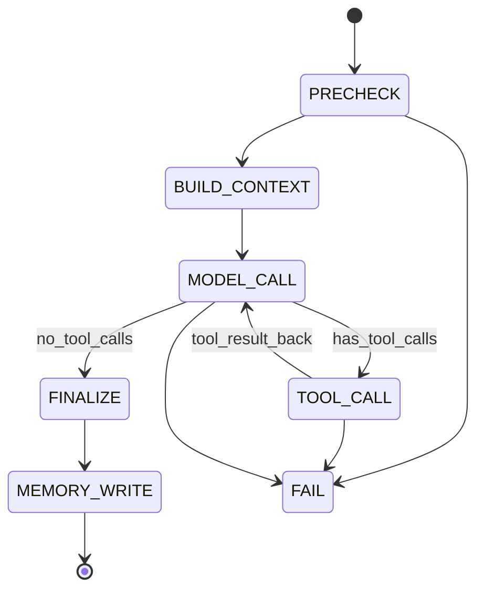

## 1. 文档信息
- 文档名称：Agent 设计说明（推理、工具、记忆、安全）
- 版本：v1.0
- 日期：2026-05-01
- 依赖文档：
- `Nexus IM + Agent 架构设计.md`
- `Java 网关与 Python Agent 接口契约.md`

---

## 2. 设计目标

1. 做成“可面试讲清楚”的 Agent，不是简单聊天接口封装。
2. 支持两种业务模式：
- 模式A：`AI助手` 独立会话
- 模式B：会话内工具能力（总结、待办、回复建议）
3. 完整闭环必须包含：
- 模型调用
- 工具调用
- 短期记忆
- 长期记忆
- 流式输出
- 安全与可观测

---

## 3. Agent 能力矩阵

| 能力 | 模式A AI助手会话 | 模式B 会话内工具 |
|---|---|---|
| 通用问答 | 支持 | 不作为主路径 |
| 聊天总结 | 支持 | 支持（主功能） |
| 待办提炼 | 支持 | 支持（主功能） |
| 回复建议 | 支持 | 支持（主功能） |
| 发布到会话 | 可选 | 必选能力 |
| 记忆读取 | 支持 | 支持 |
| 记忆写入 | 支持 | 支持（低频） |

---

## 4. 运行时组件设计

1. `AgentOrchestrator`
- 控制回合循环、超时、终止条件
- 协调模型与工具

2. `PromptBuilder`
- 组装系统提示词、业务提示词、用户输入、记忆上下文

3. `ToolExecutor`
- 执行工具调用
- 参数校验、超时控制、错误标准化

4. `MemoryManager`
- 短期记忆读写（Redis）
- 长期记忆抽取与检索（MySQL）

5. `PolicyGuard`
- 权限边界、防注入、输出合规检查

6. `ResponseStreamer`
- SSE 分片输出
- 工具事件透传与结束事件

---

## 5. Agent 状态机



终止条件：
1. 无工具调用且有最终文本。
2. 达到 `max_iterations`。
3. 超过全局超时。
4. 触发策略阻断（越权/注入/敏感输出）。

---

## 6. 提示词分层设计

## 6.1 系统层（固定）
职责：
1. 角色定义（企业 IM 助手）
2. 数据边界（仅可用工具返回的数据）
3. 行为边界（无依据不编造）
4. 输出风格（中文、简洁、可执行）

示例：
```text
你是企业IM智能助手。你必须基于工具返回的事实回答问题。
你不能访问未授权聊天数据，不能猜测未出现的事实。
当信息不足时，请明确指出“不确定”，并给出下一步建议。
```

## 6.2 业务层（按 operationType 注入）
- `ASSISTANT_CHAT`：通用问答、可调用工具
- `CHAT_SUMMARY`：输出“主题/结论/风险/下一步”
- `TODO_EXTRACT`：输出结构化待办
- `REPLY_SUGGEST`：输出 1 主建议 + 2 备选

## 6.3 用户层
- 原始输入
- 当前 chat 上下文标识（由服务端注入，不信任前端）

## 6.4 输出层约束
要求模型输出可解析结构：
```json
{
  "answer": "string",
  "confidence": 0.0,
  "needFollowUp": false,
  "followUpQuestion": ""
}
```

---

## 7. 工具设计

## 7.1 工具清单（首期）
1. `get_recent_messages(chat_id, limit, before_message_id?)`
2. `get_chat_profile(chat_id)`
3. `get_user_profile(user_id)`
4. `publish_message(chat_id, content)`
5. `get_message_by_id(message_id)`（用于回复建议）

## 7.2 工具调用策略
1. 默认 `tool_choice=auto`。
2. 对 `CHAT_SUMMARY/TODO_EXTRACT` 可设 `tool_choice=required`，防止“空想总结”。
3. 并行工具调用只允许无依赖工具（如 profile + messages）。
4. 工具参数必须通过 JSON Schema 校验。

## 7.3 工具返回规范
1. 返回“事实文本 + 结构化字段”。
2. 对模型友好文本示例：
- `消息数量：80；参与者：Alice, Bob；关键话题：报价、交付时间`
3. 错误不抛栈，统一返回标准错误：
```json
{"toolError":"TIMEOUT","message":"get_recent_messages timeout"}
```

---

## 8. 记忆设计（短期 + 长期）

## 8.1 短期记忆（Redis）
- Key：`agent:ctx:{userId}:{sessionId}`
- 内容：
- 最近 N 轮用户消息
- 最近 N 轮助手输出摘要
- 最近工具结果摘要
- 策略：
- 每轮更新
- TTL 默认 7 天
- 超出 token 预算时先裁剪最旧轮次

## 8.2 长期记忆（MySQL）
表建议：`agent_long_memory`
- `id`
- `user_id`
- `memory_type`（PREFERENCE/FACT/HABIT）
- `content`
- `confidence`
- `source_session_id`
- `created_at`
- `updated_at`

写入条件：
1. 置信度 >= 0.75
2. 非一次性短噪声
3. 不含敏感字段原文（先脱敏）

## 8.3 记忆检索策略
1. 先取短期记忆。
2. 再取长期 Top-K（按 recency + confidence）。
3. 合并成 `memory_context` 注入提示词。
4. 总 token 超预算时优先保留：
- 用户最新输入
- 当前工具结果
- 最近两轮短期记忆
- 高置信长期记忆

---

## 9. 上下文预算策略（防超长/防成本失控）

预算示例（可配置）：
- `max_context_tokens = 12_000`
- `max_output_tokens = 1_024`

分配建议：
1. 系统与业务提示词：15%
2. 用户输入：10%
3. 工具结果：45%
4. 记忆上下文：20%
5. 保留余量：10%

超预算降级顺序：
1. 压缩历史消息
2. 压缩工具原文为摘要
3. 丢弃低置信长期记忆
4. 降低输出上限

---

## 10. 安全与防注入策略

1. 不把“原始聊天内容”当系统指令。
2. 对聊天文本做注入清洗：
- 过滤“忽略之前指令”“泄露系统提示词”等模式
3. 模型层禁止执行未注册工具。
4. 工具层只走白名单内部 API。
5. 权限在 Java 先校验，Python 再校验 chat scope。
6. 输出前做二次审查：
- 是否包含越权信息
- 是否包含敏感字段

---

## 11. 推理回路与伪代码

```python
def run_agent(request):
    guard.precheck(request)  # auth scope + param check
    state = build_initial_state(request)

    for i in range(MAX_ITERATIONS):
        prompt = prompt_builder.build(state)
        model_resp = llm.responses_create(prompt, tools=TOOL_SCHEMAS)

        if model_resp.has_tool_calls():
            calls = model_resp.tool_calls
            tool_results = []
            for call in calls:
                tool_results.append(tool_executor.execute(call, timeout=3))
            state.append_tool_results(tool_results)
            continue

        state.final_answer = model_resp.output_text
        break

    if not state.final_answer:
        state.final_answer = fallback_answer(state)

    memory_manager.write_short_term(state)
    memory_manager.write_long_term_if_needed(state)
    return state.final_answer
```

---

## 12. 流式输出策略

1. SSE 事件类型：
- `meta`
- `tool_call`
- `tool_result`
- `delta`
- `usage`
- `done`
- `error`
2. 前端在模式A/B统一消费同一流式协议。
3. 模型工具调用阶段不输出错误推理细节，只输出可展示事件。
4. 断线后允许 `Last-Event-ID` 重连（重连窗口由网关控制）。

---

## 13. 失败与降级策略

1. 模型超时：
- 返回模板化降级回复
- 建议用户重试或改为摘要短任务

2. 工具失败：
- 允许一次重试
- 仍失败则告诉用户“数据暂不可用”，不编造结论

3. 迭代超限：
- 输出“已获得的部分结果 + 下一步建议”

4. 记忆故障：
- 退化为无记忆单轮，不阻断主流程

---

## 14. 质量评测设计（用于验收与面试）

## 14.1 评测集
1. `CHAT_SUMMARY` 50 条
2. `TODO_EXTRACT` 50 条
3. `REPLY_SUGGEST` 50 条
4. `ASSISTANT_CHAT` 50 条

## 14.2 指标
1. 工具调用准确率 >= 90%
2. 摘要事实一致率 >= 85%
3. 待办提炼 Precision >= 0.8
4. 流式首 token 延迟 < 1.2s
5. 非流式 P95 < 3s

## 14.3 人工评审维度
1. 可读性
2. 可执行性
3. 安全性
4. 幻觉率

---

## 15. 配置项（`nexus-agent-backend`）

```env
MODEL_PROVIDER=openai
OPENAI_API_KEY=***
OPENAI_BASE_URL=https://api.openai.com/v1
MODEL_NAME=gpt-4.1-mini
MAX_ITERATIONS=6
MODEL_TIMEOUT_SEC=20
TOOL_TIMEOUT_SEC=3

REDIS_URL=redis://localhost:6379/2
MEMORY_SHORT_TTL_SEC=604800

JAVA_INTERNAL_BASE_URL=http://nexus-backend:8080/internal/agent
JAVA_INTERNAL_TOKEN=***

ENABLE_PARALLEL_TOOL_CALLS=true
ENABLE_LONG_TERM_MEMORY=true
```

---

## 16. 开发完成定义（DoD）

1. 模式A全链路可用：会话、工具、流式、记忆。
2. 模式B三功能可用：总结、待办、回复建议。
3. 越权请求被拒绝并记录审计日志。
4. 工具调用链路可追踪，能展示耗时与错误。
5. 通过 `docs/06` 的核心验收测试。

---

## 17. 参考资料
1. OpenAI Responses API：https://platform.openai.com/docs/api-reference/responses  
2. OpenAI Function Calling：https://platform.openai.com/docs/guides/function-calling  
3. OpenAI Streaming Responses：https://platform.openai.com/docs/guides/streaming-responses  
4. LangChain Agents：https://docs.langchain.com/oss/python/langchain/agents  
5. LangGraph Memory：https://docs.langchain.com/oss/python/langgraph/add-memory  