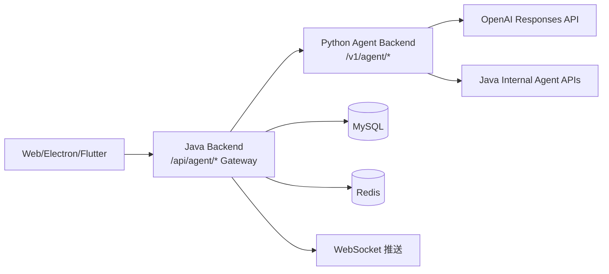
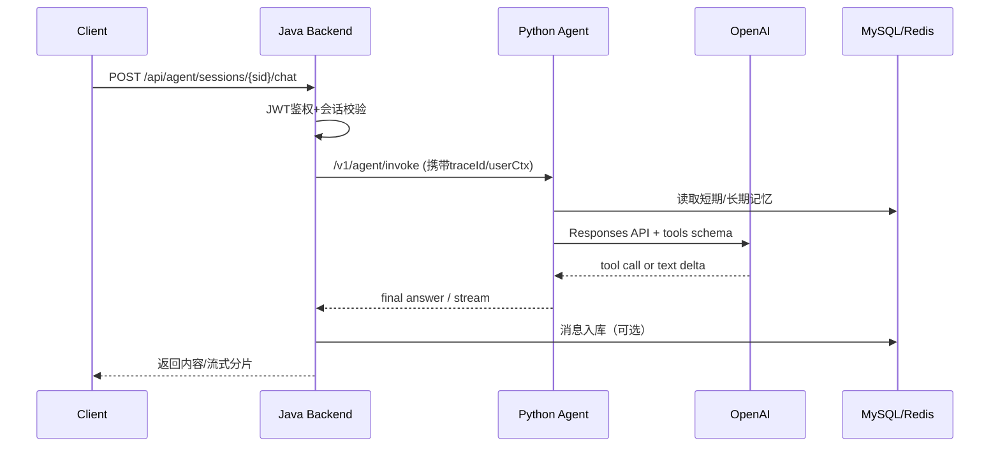
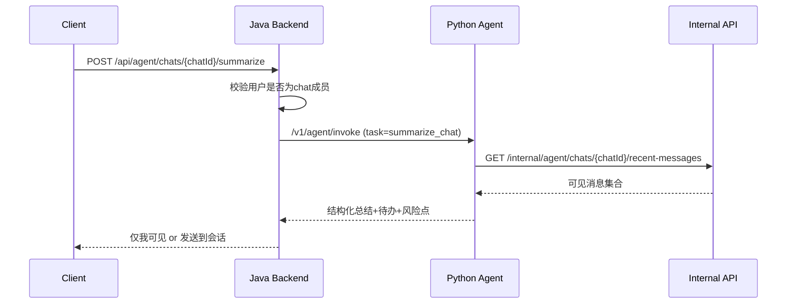

## 1. 文档信息
- 文档名称：Nexus IM + Agent 架构设计
- 文档版本：v1.0
- 适用阶段：四周完整求职版（2026-05-04 ~ 2026-05-31）
- 目标读者：后端开发、前端开发、测试、面试评审

---

## 2. 架构目标与边界

### 2.1 目标
1. 在现有 IM 系统中接入可落地的 Agent 能力，而不是独立玩具 Demo。
2. 保持 Java 后端作为统一业务入口与安全边界。
3. 新增 Python Agent 后端，负责大模型编排、工具调用、记忆与推理。
4. 支持两种用户操作模式：
- 模式A：AI 助手单独会话
- 模式B：在任意会话中触发 AI 工具（总结、待办、回复建议）

### 2.2 非目标
1. 不重构现有 IM 的消息主链路。
2. 不替换现有 Companion 3D 页面（仅保留为实验区）。
3. 不在首期引入多 Agent 协作编排。

---

## 3. 核心架构决策（ADR）

### ADR-01：AI 主入口不采用 3D Companion 页面
1. 不建议直接沿用“陪伴机器人 3D 界面”作为主入口。
2. 建议在现有 IM 聊天界面里接入一个“AI 助手账号”（像联系人/群成员）。
3. 大模型接入后，主要在 IM 会话里操作，不单独跳到 3D 页面。

### ADR-02：双模式并存，先 A 后 B
1. 模式A（优先落地）：
- 聊天列表出现 `AI助手`
- 用户像普通聊天一样提问
- 适合问答、写回复草稿、生成待办、总结最近聊天
2. 模式B（二期补齐）：
- 在任意会话页增加按钮：`总结本会话`、`提炼待办`、`生成回复建议`
- AI 输出可“仅我可见”或“发送到会话”
- 用于对当前聊天上下文做结构化分析

### ADR-03：权限模型严格绑定 IM 可见范围
1. 可总结某人聊天，但仅限“当前用户有权限查看的会话”。
2. 不允许总结或检索其他用户不可见的私密会话。
3. 权限校验在 Java 后端完成，Python 不直接信任前端参数。

---

## 4. 总体架构图

---

## 5. 组件职责

### 5.1 Java Backend（现有 `nexus-chat-backend`）
1. 认证授权（JWT、会话成员关系校验）。
2. Agent 网关：对外 `/api/agent/*`，对内转发 Python。
3. IM 消息入库与 WebSocket 推送复用现有链路。
4. 暴露工具专用内部接口 `/internal/agent/*`。
5. 统一审计日志、限流、traceId 透传。

### 5.2 Python Agent Backend（新增 `nexus-agent-backend`）
1. 模型调用（OpenAI Responses API）。
2. Agent 循环（工具选择、执行、观察、收敛输出）。
3. 短期记忆（Redis）与长期记忆（MySQL/事实库）。
4. 流式输出（SSE）与工具调用日志。
5. 异常回退（超时、工具失败、模型失败）。

### 5.3 OpenAI 模型层
1. 负责自然语言推理与工具调用决策。
2. 不直接访问数据库与业务系统。

---

## 6. 前端交互架构（已纳入你的要求）

### 6.1 统一结论
1. 主入口走 IM 聊天页，不走 Companion 3D 页面。
2. Companion 页面保留为实验区/展示区，不作为主业务入口。

### 6.2 两种操作模式
1. 模式A：`AI助手` 独立会话。
2. 模式B：会话内 AI 工具按钮。

### 6.3 求职项目必须具备的前端功能
1. `AI助手` 会话入口（聊天列表可见）。
2. 普通对话 + 流式输出。
3. 一键 `总结本会话`（最近 N 条或最近 24 小时）。
4. 一键 `提炼待办`（谁在何时做什么）。
5. 一键 `生成回复建议`（给当前用户草稿）。
6. 输出策略：`仅我可见` / `发送到会话`。

---

## 7. 关键业务流程时序

### 7.1 模式A：AI 助手会话

### 7.2 模式B：会话内“总结本会话”

---

## 8. API 边界设计

### 8.1 对外 API（Client -> Java）
1. `POST /api/agent/sessions`
2. `POST /api/agent/sessions/{sessionId}/chat`
3. `POST /api/agent/sessions/{sessionId}/chat/stream`
4. `POST /api/agent/chats/{chatId}/summarize`
5. `POST /api/agent/chats/{chatId}/todo-extract`
6. `POST /api/agent/chats/{chatId}/reply-suggest`

### 8.2 对内 API（Java -> Python）
1. `POST /v1/agent/invoke`
2. `POST /v1/agent/invoke/stream`
3. `GET /v1/agent/health`

### 8.3 工具 API（Python -> Java Internal）
1. `GET /internal/agent/chats/{chatId}/recent-messages`
2. `GET /internal/agent/chats/{chatId}/profile`
3. `GET /internal/agent/users/{userId}/profile`
4. `POST /internal/agent/messages/suggest/publish`

---

## 9. 记忆架构

### 9.1 短期记忆（会话上下文）
1. 存储：Redis
2. Key：`agent:ctx:{userId}:{sessionId}`
3. 内容：最近 N 轮消息 + 最近工具结果摘要
4. TTL：7 天（可配置）

### 9.2 长期记忆（稳定事实）
1. 存储：MySQL 表 `agent_long_memory`
2. 内容：用户偏好、固定称呼、常见业务意图
3. 触发：每轮后抽取高价值事实（低置信度不写入）

---

## 10. 安全设计

1. 只信任 JWT 身份，不信任前端传 `userId`。
2. Java 层做会话成员校验，Python 不越权读数据。
3. Java->Python 增加服务间签名头和时间戳防重放。
4. 工具调用白名单，禁止任意 URL 动态请求。
5. 日志脱敏（token、手机号、邮箱、身份证号）。

---

## 11. 可观测性设计

1. 全链路 traceId：Client -> Java -> Python -> OpenAI。
2. 监控指标：
- 请求量、成功率、P95/P99
- 工具调用次数与失败率
- 模型耗时与 token 成本
3. 审计日志：
- 谁在何时对哪个 chat 触发了什么 AI 功能
- 是否发布到公开会话

---

## 12. 风险与对策

1. 工具调用循环过长：
- 限制 `max_iterations=6`，超限回退总结结果。
2. 总结结果幻觉：
- 优先工具返回事实文本，提示词要求“无依据则说明不确定”。
3. 越权总结：
- Java 层强制校验 chat membership。
4. 成本过高：
- 长文本先压缩再送模型，限制上下文窗口与输出 token。

---

## 13. 里程碑映射

1. Week1：模式A最小闭环（非流式）。
2. Week2：模式A流式 + 短期记忆。
3. Week3：模式B三大工具 + 权限与审计。
4. Week4：长期记忆、压测、部署、面试材料。

---

## 14. 验收标准（架构层）

1. AI 主入口在 IM 内可用，Companion 页面不影响主链路。
2. 模式A/B 都可演示，且权限校验通过测试。
3. 总结/待办/回复建议支持“仅我可见”和“发送到会话”。
4. 具备完整追踪、告警、成本统计能力。

---
