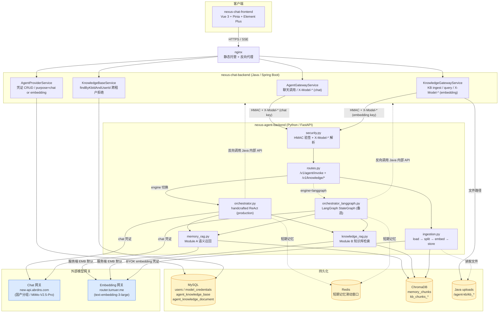
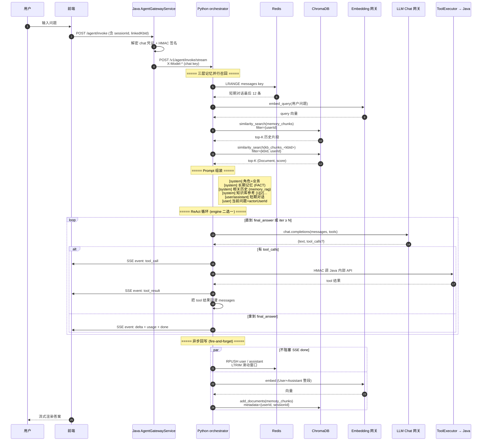
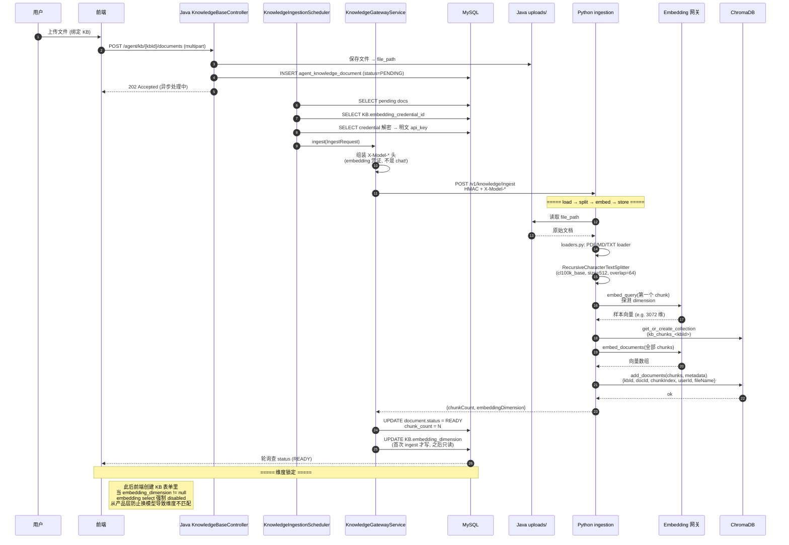
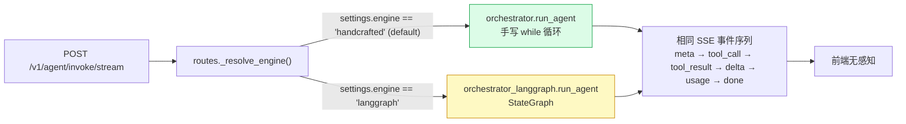

# Nexus Agent — RAG 与记忆对话架构图

本文档用 Mermaid 描述三张架构图：

- **图 A**：整体系统拓扑（前端 / Java / Python / 三类存储 / 两个外部网关）
- **图 B**：单次聊天请求时序（三层记忆 + 双模块 RAG + 编排引擎 + 异步回写）
- **图 C**：知识库文档写入时序（BYOK 凭证 + 切分嵌入 + 维度锁定）

> 渲染方式：GitHub / VS Code（Markdown Preview Mermaid Support 插件）/ Typora 直接预览即可；导出图片可用 [mermaid.live](https://mermaid.live) 粘贴源码。

---

## 图 A：整体系统拓扑



### 关键设计点

1. **两个外部网关物理分离**：chat 走 `new-api.abrdns.com`、embedding 走 `router.tumuer.me`，因为 BYOK chat 厂商（DeepSeek / Moonshot / 国产分组）通常不暴露 OpenAI 兼容的 `/embeddings`。
2. **凭证按 purpose 分家**：`model_credentials.purpose ∈ {chat, embedding}`，唯一索引 `(user_id, provider, purpose)`。
3. **双编排引擎并存**：production 默认 `handcrafted`；`ENGINE=langgraph` 可整体切换，SSE 输出格式逐字节兼容。

---

## 图 B：单次聊天请求时序（含三层记忆 + RAG）



### 关键设计点

1. **三层记忆并行**：短期（Redis）+ 语义召回（Chroma）+ 长期（Java 注入）三路并行检索后再组装 prompt。
2. **RAG 失败一律降级**：embedding 服务挂掉 → `try/except` → 返回 `[]` → 编排层无感知，自动只用短期记忆。**RAG 不能因为向量服务挂了把整个对话搞死**。
3. **写入异步化**：`asyncio.create_task(memory_rag.write())` 不阻塞 SSE `done` 事件；用模块级 `set` 持有强引用防 GC 回收。
4. **跨用户隔离**：所有 Chroma 检索都强制 metadata filter（`{userId}` / `{kbId, userId}`），数据边界在向量库层兜底；Java 端 `findByKbIdAndUserId` 是网络边界第一道。
5. **工具调用回 Java**：Python 不直接读 MySQL，通过 `ToolExecutor` 反向 HMAC 调 Java 内部 API（`get_user_profile` / `list_my_chats` / `get_recent_messages` ...），保证业务数据访问全部走 Java 权限校验。

---

## 图 C：知识库文档写入时序（BYOK + 维度锁定）



### 关键设计点

1. **异步处理**：`POST /documents` 立刻返回 202，重活交给 `KnowledgeIngestionScheduler`；前端轮询文档 status 字段直到 READY。
2. **BYOK embedding 凭证一路传递**：Java 解密 → `X-Model-*` 头携带 → Python `security.py` 解出 `provider` → `ingestion.py` 显式传给 `get_embeddings(api_key=..., base_url=..., model=...)`。**这条路径上的 X-Model-\* 是 embedding 凭证，不是 chat 凭证**——是与 chat 路径的最大区别。
3. **维度探测 + 锁定**：第一个 chunk `embed_query` 拿到向量后取 `len(vec)` 作为该 KB 的固定维度，回写 MySQL。之后前端 select `disabled`，从 UX 层防误改。
4. **Per-KB 独立 collection**：`kb_chunks_<kb_id>`，避免不同 KB 维度冲突（Chroma 集合维度首次写入即锁死）。

---

## 附：双编排引擎切换



### 切换实操

```bash
# .env
ENGINE=handcrafted    # 默认 / production
# ENGINE=langgraph    # 切到 LangGraph 引擎

# 重启 Python 服务后生效（get_settings 是 lru_cache）
```

### 选择依据

| 场景 | 选谁 |
|---|---|
| 当前简单线性 ReAct | **handcrafted**（易调试、无外部依赖） |
| 未来要做多 agent 协作 / 节点级人工审批 / 长任务 checkpointer | **langgraph**（StateGraph + Checkpointer 表达力强） |

> 双引擎并存的真正收益：(1) 验证迁移可行性 (2) 同输入下两个实现做一致性对比，发现潜在 bug。production 不切换是因为业务复杂度还没到需要 LangGraph 的阈值——**过早抽象是技术负债**。
